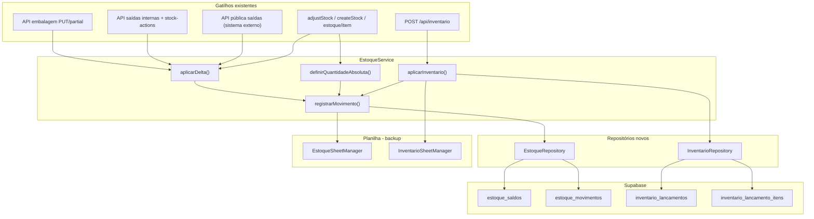

# Design: Estoque e auditoria — Fase A (migração off-planilha)

**Data:** 2026-06-02  
**Status:** Aguardando revisão do stakeholder

## Contexto

O controle de estoque hoje vive na planilha Google (`Estoque` + `Inventário`), com snapshot sobrescrito sem histórico de alterações. Embalagem e saídas atualizam o estoque via delta, mas não há rastreabilidade quando alguém edita a planilha manualmente ou corrige um lançamento.

O app já resolve **tipo de estoque** (via `public.tipos_estoque` e `clientes.tipo_estoque_id`) e **produtos** (via `public.produtos`). A coluna "cliente" na aba `Estoque` é um rótulo incorreto — na prática armazena o **nome do tipo de estoque**.

Esta spec cobre **Fase A** do plano maior de abandonar planilhas. Fases futuras migrarão embalagem, produção, saídas etc.

## Objetivos

1. Persistir saldos de estoque no Supabase por `(tipo_estoque_id, produto_id)`.
2. Registrar **todo movimento** em tabela de auditoria append-only.
3. Migrar fluxo de **inventário físico** para o Supabase.
4. Manter **dual-write** na planilha durante a transição (backup).
5. Entregar UI para consultar histórico de movimentos.

## Decisões de produto (validadas)

| Tema | Decisão |
|------|---------|
| Prioridade | Fase A = estoque + auditoria + inventário |
| Chave do estoque | `tipo_estoque_id` + `produto_id` (não cliente) |
| Quantidades | caixas, pacotes, unidades, kg (3 casas decimais em kg) |
| Auditoria | Opção A: data/hora, tipo estoque, produto, delta, saldo resultante, origem |
| Referência à fonte | Sem FK para embalagem/saída (ainda na planilha) |
| Transição | Dual-write: Supabase primeiro, planilha depois |
| Inventário | Tabelas próprias no Supabase (`inventario_lancamentos` + itens) |
| Modelo de dados | Snapshot (`estoque_saldos`) + ledger (`estoque_movimentos`) |
| Migração inicial | Upsert de saldos + movimento de abertura `ajuste_manual` por linha importada |

## Fora de escopo (Fase A)

- Migrar embalagem, fermentação, forno, saídas para Supabase
- Desligar escrita na planilha `Estoque` / `Inventário`
- FK de movimento → registro de embalagem/saída
- Resfriamento
- Usuário/autor no movimento (campo reservado para fase futura com auth)

## Schema

### Enum `estoque_movimento_origem`

```
embalagem | saida | inventario | ajuste_manual
```

### Tabela `estoque_saldos`

| Coluna | Tipo | Notas |
|--------|------|-------|
| `id` | uuid PK | default gen_random_uuid() |
| `tipo_estoque_id` | uuid FK → tipos_estoque | NOT NULL |
| `produto_id` | uuid FK → produtos | NOT NULL |
| `caixas` | integer | default 0, >= 0 exceto regra de saída |
| `pacotes` | integer | default 0 |
| `unidades` | integer | default 0 |
| `kg` | numeric(12,3) | default 0 |
| `updated_at` | timestamptz | default now() |

**Constraint:** `UNIQUE (tipo_estoque_id, produto_id)`

### Tabela `estoque_movimentos`

| Coluna | Tipo | Notas |
|--------|------|-------|
| `id` | uuid PK | |
| `created_at` | timestamptz | default now() |
| `tipo_estoque_id` | uuid FK | NOT NULL |
| `produto_id` | uuid FK | NOT NULL |
| `delta_caixas` | integer | pode ser negativo |
| `delta_pacotes` | integer | |
| `delta_unidades` | integer | |
| `delta_kg` | numeric(12,3) | |
| `saldo_caixas` | integer | saldo **após** o movimento |
| `saldo_pacotes` | integer | |
| `saldo_unidades` | integer | |
| `saldo_kg` | numeric(12,3) | |
| `origem` | estoque_movimento_origem | NOT NULL |

**Índices:** `(tipo_estoque_id, produto_id, created_at DESC)`, `(created_at DESC)`, `(origem)`

### Tabela `inventario_lancamentos`

| Coluna | Tipo | Notas |
|--------|------|-------|
| `id` | uuid PK | |
| `data` | date | NOT NULL |
| `tipo_estoque_id` | uuid FK | NOT NULL |
| `created_at` | timestamptz | default now() |

### Tabela `inventario_lancamento_itens`

| Coluna | Tipo | Notas |
|--------|------|-------|
| `id` | uuid PK | |
| `inventario_id` | uuid FK → inventario_lancamentos | ON DELETE CASCADE |
| `produto_id` | uuid FK → produtos | NOT NULL |
| `caixas` | integer | default 0 |
| `pacotes` | integer | default 0 |
| `unidades` | integer | default 0 |
| `kg` | numeric(12,3) | default 0 |

## Arquitetura



## Fluxo `registrarMovimento`

Entrada: `tipo_estoque_id`, `produto_id`, delta (4 campos), `origem`, `allowNegative?`

1. Buscar ou criar row em `estoque_saldos` (quantidades zeradas se nova).
2. Calcular novo saldo = saldo atual + delta (clamp em 0 exceto se `allowNegative`).
3. Inserir row em `estoque_movimentos` com delta e saldo resultante.
4. Atualizar `estoque_saldos`.
5. Dual-write na planilha via managers existentes (nome tipo estoque + nome produto).

**Ordem de persistência:** passos 1–4 no Supabase; passo 5 na planilha. Falha no Supabase → operação falha inteira. Falha na planilha → log de erro, operação considerada OK.

## Resolução de identificadores

Parâmetros legados usam **strings** (`cliente`, `estoqueNome`, `produto`):

- String de estoque → `tipos_estoque.id` via `findByName` (ilike, ativo)
- String de produto → `produtos.id` via nome (ilike)
- Não encontrado → HTTP 400, nada gravado

## Comportamento por origem

| Origem | Gatilho | Regra |
|--------|---------|-------|
| `embalagem` | Delta produzido novo − anterior | Credita tipo_estoque do cliente da embalagem |
| `saida` | Delta realizado ou débito na criação (inclui API pública) | Debita tipo_estoque; `allowNegative: true` |
| `inventario` | Contagem física | Completa produtos omitidos com zero; um movimento por produto cujo saldo mudou |
| `ajuste_manual` | Dashboard / API item | Delta ou absoluto via ajuste |

## Inventário (`aplicarInventario`)

1. Resolver `tipo_estoque_id` a partir do payload (`cliente` = nome do tipo).
2. Inserir `inventario_lancamentos` + `inventario_lancamento_itens`.
3. Completar produtos existentes no saldo não informados → quantidade zero (regra atual).
4. Para cada produto afetado: `registrarMovimento` com origem `inventario`.
5. Dual-write inventário na planilha (`InventarioSheetManager`) + replace estoque na planilha.

## API pública — sistema externo

Outro sistema consome endpoints autenticados por API Key (`Authorization` ou `X-API-Key`, via `apiKeyAuthService`) para lançar saídas e debitar/creditar estoque. **O contrato HTTP não muda na Fase A** — apenas a persistência interna passa pelo novo `EstoqueService`.

### `POST /api/public/saidas`

**Arquivo:** `src/app/api/public/saidas/route.ts`

**Fluxo atual (preservado):**

1. Valida API Key → 401 se inválida
2. Valida payload (`data`, `cliente`, `produto`, `meta` com ao menos uma qty > 0)
3. Grava saída na planilha (`saidasSheetManager.appendNovaSaida`)
4. Resolve `tipo_estoque` do cliente → debita estoque via `estoqueService.aplicarDelta` com `allowNegative: true`
5. Notificação WhatsApp opcional (`skipNotification`)
6. Retorna 201 com `{ success, message, data }`

**Após Fase A:** passo 4 passa por `registrarMovimento` (origem `saida`, Supabase + dual-write planilha Estoque). Request/response/status codes idênticos.

### `DELETE /api/public/saidas/delete`

**Arquivo:** `src/app/api/public/saidas/delete/route.ts`

**Fluxo atual (preservado):**

1. Valida API Key
2. Localiza saída na planilha por `data` + `cliente` + `produto` + `quantidade` (match exato em `meta`)
3. Remove linha da planilha
4. Se a saída tinha `realizado` > 0: credita estoque de volta no `tipo_estoque` do cliente (somente se tipo estoque existir)
5. Retorna 200 com `{ success, message, data: { rowId, estoqueCreditado, ... } }`

**Após Fase A:** passo 4 gera movimento `saida` com delta positivo (estorno) no Supabase + dual-write.

### Requisitos de compatibilidade

- Sem breaking changes em URL, método, headers, body ou shape de resposta
- Autenticação por API Key inalterada
- Comportamento de débito na criação e crédito no delete mantido
- Teste de integração dedicado simulando chamadas do sistema externo (POST + DELETE + verificação de saldo e movimento em `estoque_movimentos`)

## Leitura do dashboard

- `GET /api/painel/estoque` lê de `estoque_saldos` JOIN `tipos_estoque` + `produtos`.
- Durante migração: se tabela vazia, fallback único para planilha (remover após script de import).
- Response mantém shape compatível (`cliente` no JSON = `tipos_estoque.nome` por retrocompatibilidade de UI).

## UI de auditoria

**Rota:** `/estoque/auditoria`

**Filtros:** tipo de estoque, produto, origem, intervalo de datas

**Colunas:** data/hora, tipo estoque, produto, delta (cx/pct/un/kg), saldo resultante, origem

Sem drill-down para registro fonte.

## Migração inicial

**Script:** `scripts/sync-estoque-from-sheet.ts` (ou comando npm)

### Aba `Estoque`

1. Ler todas as linhas (A:H).
2. Coluna "cliente" → `tipo_estoque_id`.
3. Coluna "produto" → `produto_id`.
4. Upsert `estoque_saldos`.
5. Inserir movimento `ajuste_manual` por linha: delta = saldo importado (saldo anterior assumido zero), saldo resultante = saldo importado.

Linhas com nome não resolvido → reportar em log, não importar.

**Modo dry-run:** lista resoluções e conflitos sem gravar.

### Aba `Inventário`

Importar histórico para `inventario_lancamentos` + itens (somente leitura). **Não** gera movimentos retroativos.

## Camada de código

| Artefato | Responsabilidade |
|----------|------------------|
| `EstoqueRepository` | CRUD saldos + insert movimentos |
| `InventarioRepository` | CRUD inventário |
| `EstoqueService` | Orquestração, dual-write, resolução IDs |
| `EstoqueSheetManager` | Mantido; chamado após Supabase |
| `InventarioSheetManager` | Mantido; chamado após Supabase |

Pontos de integração existentes (inalterados em assinatura pública):

- `src/app/api/producao/embalagem/[rowId]/route.ts` (+ partial)
- `src/app/api/producao/saidas/route.ts` (+ rowId, partial, delete)
- **`src/app/api/public/saidas/route.ts`** — POST usado por sistema externo
- **`src/app/api/public/saidas/delete/route.ts`** — DELETE usado por sistema externo
- `src/app/actions/stock-actions.ts` (`registerOutflowAction`)
- `src/app/api/inventario/route.ts`
- `src/app/api/estoque/item/route.ts`

## Tratamento de erros

| Situação | Comportamento |
|----------|---------------|
| tipo_estoque ou produto não encontrado | 400, nada gravado |
| Falha Supabase | 500, planilha não tocada |
| Falha planilha após Supabase OK | Log + métrica; retorno success ao usuário |
| Saldo negativo | Permitido apenas em movimentos `saida` |

## Testes

- **Unitário:** cálculo de delta/saldo, clamp, allowNegative
- **Integração:** inventário zera omitidos; N movimentos gerados
- **Integração:** dual-write — mock sheet manager confirma ordem de chamada
- **Integração API pública:** POST `/api/public/saidas` debita Supabase + movimento `saida`; DELETE estorna corretamente
- **Migração:** dry-run reporta nomes irrecuperáveis

## Fases futuras (referência)

| Fase | Escopo |
|------|--------|
| B | Embalagem (pedido + realizado) |
| C | Produção (pedido + fermentação + forno) |
| D | Saídas |
| E | Desligar planilha; FK movimento → registro fonte |

## Critérios de aceite (Fase A)

- [ ] Tabelas criadas no Supabase com RLS adequado (service role no backend)
- [ ] Todo movimento de estoque gera row em `estoque_movimentos`
- [ ] Dashboard de estoque lê do Supabase
- [ ] Inventário grava no Supabase + dual-write planilha
- [ ] Tela de auditoria funcional com filtros
- [ ] Script de migração executado em produção com dry-run prévio
- [ ] Embalagem/saídas internas/ajustes continuam atualizando estoque corretamente
- [ ] **API pública** (`POST` + `DELETE /api/public/saidas`) mantém contrato e atualiza Supabase + auditoria
