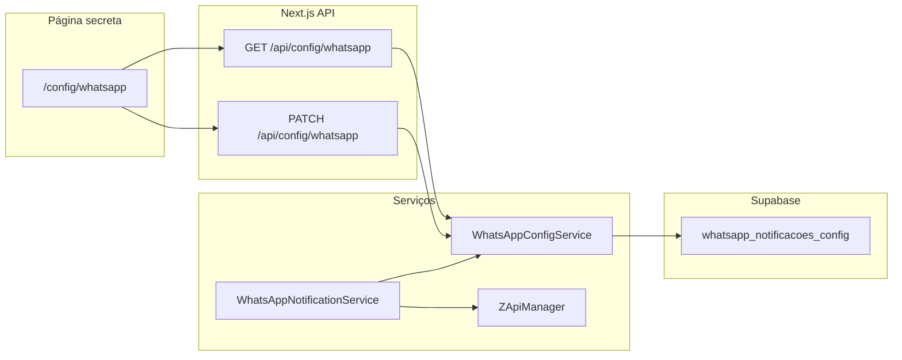

# Design: Painel de controle — notificações WhatsApp

**Data:** 2026-06-02  
**Status:** Aguardando revisão do stakeholder

## Contexto

O número WhatsApp conectado via Z-API foi bloqueado. Ao migrar para um novo número, é necessário reduzir o volume de mensagens automáticas para evitar novo bloqueio. Hoje o app envia notificações para grupos em quatro fluxos (embalagem, fermentação, forno, saídas), disparadas a cada salvamento de produção/saída, muitas vezes com resumo diário anexado.

Não existe hoje mecanismo para desligar tipos de mensagem sem alterar código ou variáveis de ambiente (que exigem redeploy).

## Objetivos

1. Página secreta no EasyDash para **ligar/desligar** cada tipo de notificação independentemente.
2. Estado inicial após deploy/migration: **todos os tipos desligados**.
3. Decisão de envio centralizada no `WhatsAppNotificationService` — produção e planilhas continuam funcionando normalmente.
4. Mudanças entram em vigor **sem redeploy** (persistência em Supabase).

## Decisões de produto (validadas)

| Tema | Decisão |
|------|---------|
| Solução | Painel (não apenas env vars) |
| Granularidade | 4 toggles por tipo; **sem** master switch global |
| Acesso ao painel | Rota secreta, **sem** link no menu, **sem** senha/PIN/login |
| Público pretendido | Gestão (segurança por obscuridade da URL) |
| Estado inicial | Embalagem, fermentação, forno e saídas = **off** |

## Mapeamento tipo → código

| Toggle (UI) | Coluna DB | Método | Variável de grupo |
|-------------|-----------|--------|-------------------|
| Embalagem | `embalagem_habilitado` | `notifyEmbalagemProduction` | `WHATSAPP_GRUPO_EMBALAGEM` |
| Fermentação | `fermentacao_habilitado` | `notifyFermentacaoProduction` | `WHATSAPP_GRUPO_PRODUCAO` |
| Forno | `forno_habilitado` | `notifyFornoProduction` | `WHATSAPP_GRUPO_FORNO` |
| Saídas | `saidas_habilitado` | `notifySaidasProduction` | `WHATSAPP_GRUPO_SAIDAS` |

Resfriamento **não** envia WhatsApp hoje e permanece fora do escopo.

Pontos de chamada existentes (inalterados em quantidade; só passam pelo gate):

- `src/app/api/producao/embalagem/[rowId]/route.ts`
- `src/app/api/producao/embalagem/[rowId]/partial/route.ts`
- `src/app/api/producao/fermentacao/[rowId]/route.ts`
- `src/app/api/producao/forno/[rowId]/route.ts`
- `src/app/api/producao/saidas/route.ts`
- `src/app/api/producao/saidas/[rowId]/route.ts`
- `src/app/api/producao/saidas/[rowId]/partial/route.ts`
- `src/app/api/public/saidas/route.ts`
- `src/app/actions/stock-actions.ts`

## Arquitetura



### Fluxo de envio (ordem de checagem)

Em `sendMessageToConfiguredGroup`, antes de qualquer chamada à Z-API:

1. Tipo desabilitado na config → retorna `false` (silencioso, igual quando grupo não está configurado).
2. `grupoId` ausente → `false`.
3. Instância Z-API desconectada → `false`.
4. Monta mensagem e envia.

### Cache

`WhatsAppConfigService` mantém cache em memória com TTL de **30 segundos** para evitar leitura no banco a cada salvamento de produção. Cache é **invalidado** após `PATCH` bem-sucedido.

## Modelo de dados

### Tabela `whatsapp_notificacoes_config`

Singleton (uma única linha de configuração global).

| Coluna | Tipo | Default (migration) |
|--------|------|---------------------|
| `id` | `uuid` PK | `gen_random_uuid()` na insert inicial |
| `embalagem_habilitado` | `boolean` NOT NULL | `false` |
| `fermentacao_habilitado` | `boolean` NOT NULL | `false` |
| `forno_habilitado` | `boolean` NOT NULL | `false` |
| `saidas_habilitado` | `boolean` NOT NULL | `false` |
| `updated_at` | `timestamptz` NOT NULL | `now()` |

Migration SQL (`WHATSAPP_NOTIFICACOES_CONFIG.sql` na raiz do repo, padrão existente):

- `CREATE TABLE` com RLS habilitado.
- `INSERT` da linha inicial com todos `false`.
- Políticas RLS: leitura e escrita apenas via service role (API interna). Sem políticas para `anon` / usuário autenticado, pois o app interno não expõe Supabase client-side para esta tabela.

Atualizar `src/types/database.ts` (e `types/database.ts` se mantido em sync) após aplicar migration.

## API

### `GET /api/config/whatsapp`

**Resposta 200:**

```json
{
  "embalagem": false,
  "fermentacao": false,
  "forno": false,
  "saidas": false,
  "updatedAt": "2026-06-02T12:00:00.000Z",
  "zapiConnected": true
}
```

- `zapiConnected`: resultado de `zapiManager.isInstanceConnected()` (informativo na UI).
- Se a linha de config não existir (edge case), retornar todos `false` e logar warning no servidor.

### `PATCH /api/config/whatsapp`

**Body** (todos os campos opcionais; enviar só o que mudou):

```json
{
  "embalagem": true,
  "fermentacao": false
}
```

**Resposta 200:** mesmo shape do GET após persistir.

**Erros:**

- `400` — body inválido (não-boolean).
- `500` — falha Supabase ou config ausente e não recuperável.

Sem autenticação HTTP adicional (decisão explícita: URL secreta).

## UI — `/config/whatsapp`

- **Não** adicionar link em `Navigation.tsx`.
- Página client component com layout consistente EasyDash (fundo escuro, cards glass, accent laranja `#e67e22` para switches ativos).
- Conteúdo:
  - Título: "Notificações WhatsApp"
  - Subtítulo explicando que desligado = produção salva normalmente, só não envia mensagem.
  - Badge de status Z-API: Conectado / Desconectado.
  - 4 switches com label + descrição curta (ex.: "Embalagem — grupo de embalagem").
  - Botão "Salvar" ou auto-save por toggle (preferência implementação: **salvar ao alternar** cada switch com debounce/loading por item para menos cliques).
- Mensagem de sucesso/erro visível após salvar.
- `robots`: não necessário (app interno); opcional `noindex` na página se houver metadata.

## Componentes / arquivos novos (previstos)

| Arquivo | Responsabilidade |
|---------|------------------|
| `src/lib/services/whatsapp-config-service.ts` | Leitura/escrita Supabase + cache + tipos |
| `src/app/api/config/whatsapp/route.ts` | GET + PATCH |
| `src/app/config/whatsapp/page.tsx` | Painel de toggles |
| `WHATSAPP_NOTIFICACOES_CONFIG.sql` | Migration |

Alterações em arquivo existente:

- `src/lib/services/whatsapp-notification-service.ts` — receber `stageKey` e consultar config.
- `env.example` — comentário documentando rota secreta (sem secrets).

## Segurança e limitações

- Quem descobrir `/config/whatsapp` pode alterar flags (aceito pelo stakeholder).
- API de config **não** deve ser exposta em documentação pública da API externa.
- Recomendação operacional: não compartilhar a URL em grupos amplos; considerar PIN futuro se necessário.

## Fora de escopo

- Master switch "desligar tudo".
- Login Supabase / `is_admin()` / PIN.
- Toggle separado para "resumo do dia" vs "evento".
- WhatsApp para resfriamento.
- Fila, rate limit, agendamento ou digest de mensagens.
- Log de auditoria (quem alterou e quando).
- Alterar credenciais Z-API pelo painel (continua em `.env`).

## Testes / verificação manual

1. Após migration: GET retorna todos `false`; salvar produção em embalagem **não** envia WhatsApp.
2. Ligar só "Saídas" no painel; registrar saída → mensagem enviada; embalagem ainda não envia.
3. Desligar "Saídas"; nova saída não envia.
4. Z-API desconectada: badge mostra desconectado; envio retorna `false` mesmo com toggle on.
5. Toggle off com Z-API conectada: não chama `sendMessageToGroup` (verificar logs ou mock).
6. PATCH invalida cache: toggle na UI reflete no próximo envio em &lt; 30s sem restart.
7. Produção/planilha/estoque persistem independentemente do estado dos toggles.

## Referências de código

- `src/lib/services/whatsapp-notification-service.ts`
- `src/lib/managers/zapi-manager.ts`
- `src/lib/utils/whatsapp-message-formatter.ts`
- `env.example` (grupos Z-API)
