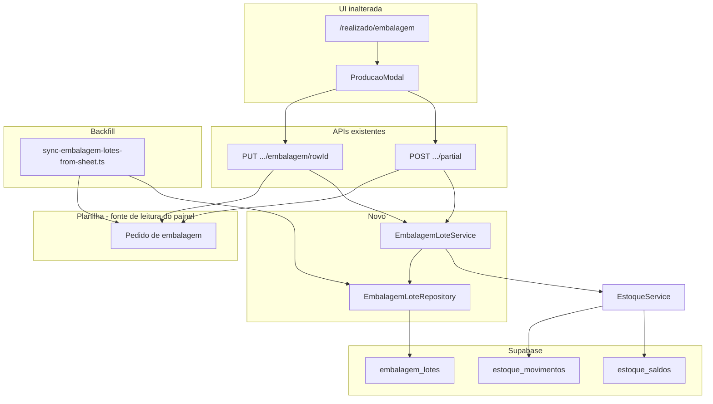

# Design: Embalagem — Lotes de realizado (Fase B.1)

**Data:** 2026-06-03  
**Status:** Aprovado pelo stakeholder  
**Depende de:** Fase A estoque/auditoria (`estoque_movimentos`, `EstoqueService`, resolução `tipo_estoque_id` / `produto_id`)

## Contexto

O plano maior é abandonar planilhas como fonte de dados. A **Fase A** migrou estoque, inventário e auditoria de movimentos para o Supabase, mantendo dual-write na planilha `Estoque` / `Inventário`.

A **Fase B** migra embalagem. O stakeholder priorizou **realizado (lotes)** antes de **pedido**, porque pedido envolve mais fluxos (criação comercial, painel pedido × embalado, duplicar, etiquetas).

Hoje, cada confirmação de embalagem na planilha `Pedido de embalagem` funciona assim:

- **PUT** (`/api/producao/embalagem/[rowId]`) — sobrescreve produção (colunas M–P) na mesma linha; estoque recebe delta `novo − anterior`.
- **POST partial** (`/api/producao/embalagem/[rowId]/partial`) — reduz pedido (G–J) na linha original, **insere nova linha** com o lote (pedido = produção = quantidade embalada); estoque credita o lote inteiro.

O painel `/api/painel/embalagem` e a tela `/realizado/embalagem` **continuam lendo só a planilha** nesta fase.

## Objetivos (B.1)

1. Persistir cada lote embalado em `embalagem_lotes` (append-only no banco).
2. Vincular movimentos de estoque com origem `embalagem` ao lote via `embalagem_lote_id` (opcional, nullable em movimentos antigos).
3. Manter **dual-write** na planilha e **UI inalterada** (painel lê planilha).
4. Oferecer **job de backfill** importando histórico da planilha (default últimos 7 dias, parâmetros configuráveis).
5. Preparar schema para **Fase B.2** (pedido no Supabase) com `pedido_embalagem_id` nullable.

## Decisões de produto (validadas)

| Tema | Decisão |
|------|---------|
| Prioridade dentro de B | B.1 = lotes de realizado; pedido = B.2 |
| Leitura do painel | Planilha (opção A); sem somar lotes do DB na TV ainda |
| Escrita | Dual-write: planilha como hoje + insert lote no Supabase |
| Ordem de persistência | Supabase (lote + movimento estoque) com mesma política da Fase A: falha DB → falha operação; falha planilha após DB OK → log, success ao usuário |
| Backfill | Job importa lotes; **não** recria movimentos de estoque |
| Janela default do job | `--days=7` (fuso Brasil, filtro por `data_pedido` coluna A) |
| Pedido no DB | Fora de escopo; `pedido_embalagem_id` reservado NULL |

## Fora de escopo (B.1)

- Migrar criação/edição de **pedido** (`POST /api/submit/embalagem-pedido`, edit/delete pedido)
- Painel `/api/painel/embalagem` ler `SUM(lotes)` do Supabase
- Migrar upload de fotos de `rowId` para uuid do lote (fotos continuam na planilha + Drive)
- Desligar escrita na planilha `Pedido de embalagem`
- Fermentação, forno, saídas, resfriamento
- Usuário/autor no lote

## Schema

### Enum `embalagem_lote_modo`

```
parcial       -- lote criado via POST partial (nova linha na planilha)
substituicao  -- lote registrado via PUT (produção final na mesma linha)
importado     -- criado pelo job sync-embalagem-lotes-from-sheet
```

### Tabela `embalagem_lotes`

| Coluna | Tipo | Notas |
|--------|------|-------|
| `id` | uuid PK | default `gen_random_uuid()` |
| `created_at` | timestamptz | default `now()` |
| `produzido_em` | timestamptz | coluna Q da planilha ou K se Q vazio |
| `modo` | `embalagem_lote_modo` | NOT NULL |
| `planilha_row_id` | integer | UNIQUE quando NOT NULL — linha que representa o lote |
| `planilha_row_id_origem` | integer | nullable — linha do pedido no partial |
| `pedido_embalagem_id` | uuid | nullable — B.2 |
| `data_pedido` | date | coluna A |
| `data_fabricacao` | date | coluna B |
| `tipo_estoque_id` | uuid FK → `tipos_estoque` | NOT NULL |
| `produto_id` | uuid FK → `produtos` | NOT NULL |
| `congelado` | text | `'Sim'` \| `'Não'` |
| `lote` | integer | nullable — coluna AA |
| `caixas` | integer | NOT NULL DEFAULT 0 |
| `pacotes` | integer | NOT NULL DEFAULT 0 |
| `unidades` | integer | NOT NULL DEFAULT 0 |
| `kg` | numeric(12,3) | NOT NULL DEFAULT 0 |
| `obs_embalagem` | text | coluna AC |
| `pacote_foto_url` | text | |
| `pacote_foto_id` | text | |
| `pacote_foto_uploaded_at` | timestamptz | |
| `etiqueta_foto_url` | text | |
| `etiqueta_foto_id` | text | |
| `etiqueta_foto_uploaded_at` | timestamptz | |
| `pallet_foto_url` | text | |
| `pallet_foto_id` | text | |
| `pallet_foto_uploaded_at` | timestamptz | |
| `producao_anterior` | jsonb | nullable — só `substituicao`: `{ caixas, pacotes, unidades, kg }` antes do PUT |

**Índices:**

- `UNIQUE (planilha_row_id)` WHERE `planilha_row_id IS NOT NULL`
- `(data_pedido DESC)`
- `(tipo_estoque_id, produto_id, produzido_em DESC)`

### Alteração em `estoque_movimentos`

| Coluna | Tipo | Notas |
|--------|------|-------|
| `embalagem_lote_id` | uuid FK → `embalagem_lotes(id)` | NULLABLE; preenchido em movimentos `origem = 'embalagem'` gerados após B.1 |

Movimentos históricos e backfill de estoque permanecem com `embalagem_lote_id` NULL.

### RLS

Mesmo padrão da Fase A: RLS habilitado; acesso via `service_role` no backend. Script `EMBALAGEM_LOTES_RLS.sql` espelhando `ESTOQUE_RLS.sql`.

## Arquitetura



## Fluxos de escrita

### POST partial

1. Lógica atual na planilha (reduz G–J, append linha, retorna `novaLinhaRowId`).
2. `EmbalagemLoteService.criarLoteParcial`:
   - Resolve `tipo_estoque_id` / `produto_id` via `estoqueResolverService` (nomes da linha original).
   - Insert `embalagem_lotes` com `modo = 'parcial'`, `planilha_row_id = novaLinhaRowId`, `planilha_row_id_origem = rowId` do pedido.
3. `estoqueService.aplicarDelta` com `origem: 'embalagem'` e `embalagemLoteId` no movimento.

Contrato HTTP e resposta (`novaLinhaRowId`, etc.) **inalterados**.

### PUT (substituição)

1. Lógica atual na planilha (atualiza M–P, AC).
2. `EmbalagemLoteService.criarLoteSubstituicao`:
   - `modo = 'substituicao'`
   - `planilha_row_id = rowId`
   - quantidades finais do body
   - `producao_anterior` = valores M–P lidos antes do update
3. `atualizarEstoque` existente (delta `novo − anterior`) com `embalagem_lote_id` no movimento.

### Resolução de IDs

Reutilizar `estoqueResolverService` / `clientesService.obterTipoEstoqueCliente` — mesmo padrão da Fase A. Nome não resolvido → 400, nada gravado no Supabase (planilha não deve ser alterada se validação ocorrer antes; se planilha já foi alterada, alinhar ordem: validar IDs **antes** de escrever na planilha).

## Job de sincronização

**Arquivo:** `scripts/sync-embalagem-lotes-from-sheet.ts`  
**npm:** `sync:embalagem-lotes` (script em `package.json`)

### Parâmetros CLI

| Parâmetro | Default | Descrição |
|-----------|---------|-----------|
| `--days=N` | `7` | `data_pedido` ≥ hoje − N (America/Sao_Paulo) |
| `--since=YYYY-MM-DD` | — | Se presente, substitui `--days` |
| `--dry-run` | off | Log de linhas elegíveis sem insert |
| `--force` | off | Upsert por `planilha_row_id` se já existir |

### Critério de inclusão

- Aba `PEDIDOS_EMBALAGEM_CONFIG.destinoPedidos` (`Pedido de embalagem`), range `A:AC`.
- `data_pedido` dentro da janela.
- `caixas + pacotes + unidades + kg` em **M–P** > 0.

### Mapeamento

- `produzido_em` ← coluna Q; se vazio, parse coluna K (`created_at`).
- Demais campos conforme tabela na seção Schema.

**Modo no job:** sempre `importado` (diferencia backfill de operações ao vivo, que usam `parcial` ou `substituicao`).

### Idempotência

- Insert skip se `planilha_row_id` já existe.
- `--force`: update row existente (quantidades, fotos, `produzido_em`).

### O que o job não faz

- Não insere em `estoque_movimentos`.
- Não altera `estoque_saldos`.
- Não modifica a planilha.

### Relatório stdout

Contadores: lidas, elegíveis, criadas, ignoradas (janela, sem produção, duplicata), erros de resolução (lista de cliente/produto).

### Limitação documentada

PUT na planilha **sobrescreve** M–P: o backfill captura o **estado final** da linha, não tentativas intermediárias. Parciais antigos aparecem como linhas separadas — cada uma pode virar um lote.

## Camada de código

| Artefato | Responsabilidade |
|----------|------------------|
| `CREATE_EMBALAGEM_LOTES_TABLES.sql` | tabela + enum + FK em `estoque_movimentos` |
| `EMBALAGEM_LOTES_RLS.sql` | políticas service_role |
| `EmbalagemLoteRepository` | CRUD insert, findByPlanilhaRowId, upsert for force |
| `EmbalagemLoteService` | criarLoteParcial, criarLoteSubstituicao, mapeamento domain |
| `EstoqueRepository.insertMovimento` | aceitar `embalagemLoteId` opcional |
| `EstoqueService.registrarMovimento` | repassar `embalagemLoteId` quando origem embalagem |
| `partial/route.ts`, `[rowId]/route.ts` | orquestrar serviço após planilha |
| `sync-embalagem-lotes-from-sheet.ts` | backfill |
| `types/database.ts` | regenerar/atualizar tipos Supabase |

## Tratamento de erros

| Situação | Comportamento |
|----------|---------------|
| Cliente/produto não resolve para UUID | 400 antes de gravar (ideal: antes da planilha) |
| Falha insert `embalagem_lotes` | 500; operação falha |
| Falha `estoque_movimentos` após lote criado | 500; no `catch`, deletar o lote recém-criado (compensação best-effort) |
| Falha planilha após Supabase OK | Log; retorno success ao usuário (Fase A) |
| Job: nome irrecuperável | skip linha + log |

## Testes

- **Unitário:** heurística parcial vs substituicao no job; parse de datas BR.
- **Integração:** partial cria lote + movimento com `embalagem_lote_id`; PUT cria lote substituicao com `producao_anterior`.
- **Integração:** reexecução job sem `--force` não duplica.
- **Integração:** `--dry-run` não altera contagem em `embalagem_lotes`.

## Critérios de aceite (B.1)

- [ ] Migration aplicada em produção (tabela + FK + RLS)
- [ ] Cada POST partial bem-sucedido gera 1 row em `embalagem_lotes` e movimento estoque com `embalagem_lote_id`
- [ ] Cada PUT bem-sucedido gera 1 row `substituicao` e movimento com `embalagem_lote_id` quando delta ≠ 0
- [ ] Painel e `/realizado/embalagem` comportam-se como antes (leitura planilha)
- [ ] `npm run sync:embalagem-lotes` default 7 dias; `--since`, `--dry-run`, `--force` documentados em comentário do script
- [ ] Backfill não cria movimentos de estoque
- [ ] Tipos TypeScript atualizados

## Fases futuras (referência)

| Fase | Escopo |
|------|--------|
| B.1 | Lotes realizado + backfill + FK estoque (esta spec) |
| B.2 | Pedido embalagem no Supabase |
| B.3 | Painel lê pedido + `produzido` do DB |
| C | Fermentação + forno |
| D | Saídas |
| E | Desligar planilhas |
