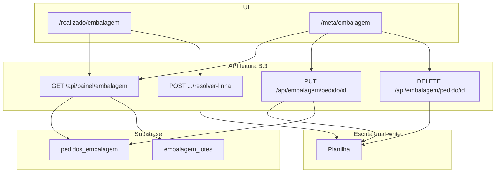

# Design: Embalagem — Painel lê Supabase (Fase B.3)

**Data:** 2026-06-05  
**Status:** Aprovado pelo stakeholder  
**Depende de:** B.1 (`embalagem_lotes`), B.2 (`pedidos_embalagem`, reconcile), B.2.1 (`pedido_embalagem_id`)

## Contexto

Fases anteriores migraram **escrita** (dual-write + reconcile) e **vínculo** lote→pedido. Leitura do painel (`GET /api/painel/embalagem`), `/realizado/embalagem` e `/meta/embalagem` **ainda usam a planilha linha a linha**, causando divergência (ex.: 966 cx na tela vs 860 cx agregado no DB).

O stakeholder definiu UI hierárquica:

- **Card pai** = 1 `pedidos_embalagem` (meta canônica: ex. 225 cx Damiao + obs + produto)
- **Expand (seta)** = lista `embalagem_lotes` reais (50 cx, 3 cx…)
- **Sem** sub-linha fantasma “0 / saldo restante”
- **Botão “Novo lote” (+)** no pai = iniciar embalagem do saldo; backend resolve `planilha_row_id`

## Objetivos (B.3)

1. `GET /api/painel/embalagem` lê **pedidos + lotes** do Supabase (não planilha para lista principal).
2. `/realizado/embalagem` e `/meta/embalagem` consomem a **mesma** resposta canônica.
3. UI hierárquica pedido → lotes; dashboard soma DB.
4. Meta **editar/excluir** por `pedidoEmbalagemId` (pedido canônico).
5. Novo fluxo **Novo lote** por `pedidoEmbalagemId` com resolução de linha planilha no servidor.

## Decisões de produto (validadas)

| Tema | Decisão |
|------|---------|
| Granularidade | 1 item pai = `pedidos_embalagem`; filhos = `embalagem_lotes` |
| Linha saldo 0/N | **Não exibir** — saldo só no card pai (`produzido` / `pedido`) |
| Novo lote | Botão **separado** da seta expand; label “+” / “Novo lote” |
| Escopo telas | **Realizado + Meta** na mesma API |
| Meta edit/delete | **Pedido canônico** (`pedidoEmbalagemId`), API dedicada |
| Abordagem API | **Resposta aninhada** `pedidos[]` com `lotes[]` |
| Escrita | **Inalterada** na planilha (PUT/partial/create B.2); B.3 é leitura + novas rotas meta/novo-lote |
| Congelado/etiqueta no pai | Legado planilha ou default até fase etiquetas; lotes trazem `congelado` do DB |

## Fora de escopo (B.3)

- Desligar escrita na planilha
- Redesign etiqueta/congelado no schema
- Preencher campos de etiqueta só no DB
- Histórico fora da data consultada (sem `--since` no painel)

## Resposta da API

### `GET /api/painel/embalagem?date=YYYY-MM-DD`

```typescript
type PainelEmbalagemResponse = {
  date: string;
  pedidos: PainelPedidoEmbalagem[];
};

type PainelPedidoEmbalagem = {
  pedidoEmbalagemId: string;
  cliente: string;           // nome tipo estoque
  produto: string;
  observacao: string;
  dataPedido: string;        // data_producao
  dataFabricacao: string;    // data_fabricacao_etiqueta
  congelado?: 'Sim' | 'Não'; // legado; opcional no pai
  pedido: Quantidade;        // pedidos_embalagem G–J equivalente
  produzido: Quantidade;     // SUM(lotes)
  possuiEtiqueta: boolean;
  lote?: number;
  etiquetaGerada?: boolean;
  lotes: PainelLoteEmbalagem[];
};

type PainelLoteEmbalagem = {
  loteId: string;
  planilhaRowId: number;
  modo: 'parcial' | 'substituicao' | 'importado';
  quantidade: Quantidade;
  produzidoEm: string;
  obsEmbalagem?: string;
  congelado: 'Sim' | 'Não';
  lote?: number | null;
  pacoteFotoUrl?: string;
  etiquetaFotoUrl?: string;
  palletFotoUrl?: string;
  // ids/uploadedAt se necessário para UI
};
```

**Remover** `revalidate = 3600` ou reduzir — leitura DB; invalidação via `revalidatePath` nas escritas.

### Montagem (serviço)

1. `PedidoEmbalagemRepository.listByDataProducao(date)`
2. Para cada pedido: resolver nome cliente/produto
3. `EmbalagemLoteRepository.listByPedidoEmbalagemId(id)` → `lotes[]` + `produzido` agregado
4. Lotes com `pedido_embalagem_id` NULL na mesma data: fallback resolver por chave natural (opcional, log)
5. `possuiEtiqueta` via `estoqueService.clientePossuiEtiqueta(cliente)`

## Realizado — UI

```
[› expand]  HB Brioche 65g  53/225 cx  [+ Novo lote]
     └─ 50 cx · 12:56 📷
     └─  3 cx · 13:01 📷
```

- Agrupamento cliente|dataFab|obs **mantido**; dentro, **1 accordion por `pedidoEmbalagemId`** (não agrupar várias linhas planilha do mesmo produto).
- **Expand:** só `pedido.lotes`.
- **Novo lote:** abre `ProducaoModal` com `pedidoEmbalagemId`.
- **Sub-lote:** editar/fotos via `planilhaRowId` (APIs produção existentes).
- `EmbalagemDashboard`: totais e hourly de `pedidos` + `lotes` do response.

## Meta — UI

- Lista flat ou agrupada: **1 card por `pedidos_embalagem`**.
- **Editar:** `GET/PUT /api/embalagem/pedido/[pedidoEmbalagemId]`
- **Excluir:** `DELETE /api/embalagem/pedido/[pedidoEmbalagemId]` — remove linhas planilha da chave + reconcile
- **Criar:** `POST /api/submit/embalagem-pedido` (inalterado)

### `PUT /api/embalagem/pedido/[id]`

- Validar FKs → atualizar planilha (linhas da chave ou política documentada) → `reconcileForDate`

### `DELETE /api/embalagem/pedido/[id]`

- Ler chave do pedido → deletar **todas** as linhas planilha com mesma chave (A–J) na data → `reconcileForDate` → pedido some do DB

## Novo lote

### `POST /api/producao/embalagem/pedido/[pedidoEmbalagemId]/resolver-linha`

Retorna `{ planilhaRowId }` da primeira linha planilha com saldo G–J > 0 para a chave do pedido (ordem: menor `rowId`).

O front abre `ProducaoModal` com esse `rowId` (fluxo partial/PUT existente).

Alternativa: rota única que aceita body de produção e delega ao partial internamente — **preferir resolver-linha + modal existente** (menor diff).

## Arquitetura



## Camada de código

| Artefato | Responsabilidade |
|----------|------------------|
| `PainelEmbalagemService` | montar `pedidos[]` + agregados |
| `EmbalagemLoteRepository.listByPedidoEmbalagemId` | lotes do pedido |
| `painel/embalagem/route.ts` | GET DB-only |
| `embalagem/pedido/[id]/route.ts` | GET/PUT/DELETE canônico |
| `producao/embalagem/pedido/[id]/resolver-linha/route.ts` | rowId para novo lote |
| `realizado/embalagem/page.tsx` | hierárquico + Novo lote |
| `meta/embalagem/page.tsx` | lista canônica + edit por id |
| `EmbalagemProductAccordion` | slot botão Novo lote |
| `groupEmbalagemItemsByProduto` | refatorar ou substituir por pedido id |

## Tratamento de erros

| Situação | Comportamento |
|----------|---------------|
| Pedido sem lotes | `produzido` zero; `lotes: []` |
| Novo lote sem linha com saldo | 400 “Nenhuma linha com saldo na planilha” |
| Lotes órfãos (FK null) | Não aparecem no pai; log + job link |
| Delete pedido com lotes | Política: bloquear delete se `produzido > 0` **ou** permitir com confirmação — **bloquear se SUM(lotes)>0** (recomendado) |

## Testes

- Unitário: agregação `produzido` = SUM(lotes)
- Unitário: mapper pedido → response
- Integração: GET painel data conhecida vs SQL manual
- Manual: expand só lotes; sem linha 0/N; Novo lote abre modal

## Critérios de aceite

- [ ] GET painel não lê planilha para montar lista
- [ ] Realizado: pai = pedido canônico; expand = lotes DB
- [ ] Sem sub-linha saldo fantasma
- [ ] Botão Novo lote + seta expand separados
- [ ] Meta lista/edita/exclui por `pedidoEmbalagemId`
- [ ] Dashboard totais batem com DB na data
- [ ] Totais meta/realizado alinhados (sem duplicata planilha na leitura)

## Fases futuras

| Fase | Escopo |
|------|--------|
| B.3 | Painel lê DB (esta spec) |
| Etiquetas | congelado/lote/etiqueta no schema |
| E | Desligar planilha |
