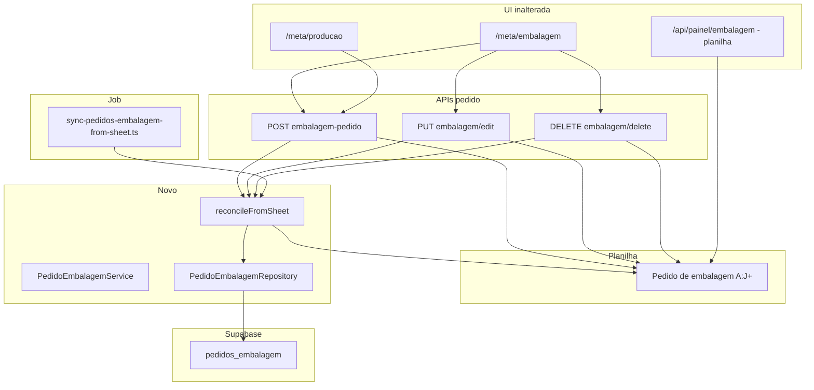

# Design: Embalagem — Pedidos de meta (Fase B.2)

**Data:** 2026-06-03  
**Status:** Aprovado pelo stakeholder  
**Depende de:** Fase A estoque; Fase B.1 (`embalagem_lotes`, `estoqueResolverService`, coluna `pedido_embalagem_id` reservada)

## Contexto

A **Fase B.1** migrou **realizado** (lotes M–P) para `embalagem_lotes`, com dual-write na planilha e painel lendo só a planilha.

A **Fase B.2** migra **pedido/meta** (colunas A–J da aba `Pedido de embalagem`): quantidades pedidas, datas, tipo de estoque, produto e observação do cliente. O painel `/api/painel/embalagem`, TV e `/realizado/embalagem` **continuam lendo só a planilha** até a B.3.

Hoje o pedido é escrito por:

- `POST /api/submit/embalagem-pedido` (meta embalagem + meta produção)
- `PUT` / `DELETE` `/api/embalagem/edit|delete/[rowId]`
- Leitura de edição/duplicar: `GET` nas mesmas rotas (planilha)

A planilha pode ter **várias linhas** com a mesma chave de negócio; o Supabase guarda **uma linha canônica** com quantidades **somadas**.

## Objetivos (B.2)

1. Tabela `pedidos_embalagem` com FKs `tipo_estoque_id` e `produto_id` (mesmo resolver da B.1).
2. **Dual-write:** planilha inalterada no processo; APIs escrevem na planilha como hoje.
3. **Reconcile** pós-escrita: banco = agregado da planilha por chave natural.
4. Job `sync-pedidos-embalagem-from-sheet` na janela **hoje ± 3 dias** (filtro só `data_producao`, coluna A, fuso Brasil) — banco **nem a mais, nem a menos** na janela.
5. Constraint única e merge de duplicatas na planilha no banco (planilha não deduplica).

## Decisões de produto (validadas)

| Tema | Decisão |
|------|---------|
| Escopo B.2 | Só **escrita** de pedido; leitura do painel = B.3 |
| Modelo de dados | **Opção D** — linha lógica canônica (flat), não cabeçalho + itens |
| Chave única | `data_producao` + `data_fabricacao_etiqueta` + `tipo_estoque_id` + `produto_id` + `observacao` |
| Duplicata na planilha | Somar G–J em um registro no DB; planilha intacta |
| Congelado / lote / etiqueta | Fora do DB nesta fase; continuam na planilha; redesign na fase etiquetas |
| Congelado fora da chave | Duas linhas iguais só em F → **um** registro somado no DB (limitação documentada) |
| Janela do job | −3 / +3 dias em **`data_producao` (A)** apenas |
| Após cada API | Reconcile só no(s) **`data_producao`** afetado(s) |
| Ordem operacional | Validar FKs **antes** da planilha → planilha → reconcile obrigatório |
| Falha planilha | Erro ao usuário; reconcile não roda |
| Falha reconcile | **500** + log (planilha já alterada; job corrige) |
| Política vs B.1 lotes | Lotes/estoque mantêm regra B.1; pedido agregado usa reconcile pós-planilha |

## Fora de escopo (B.2)

- Painel `/api/painel/embalagem` ler `pedidos_embalagem` ou somar lotes do DB (B.3)
- Preencher `embalagem_lotes.pedido_embalagem_id` (opcional B.2.1)
- Novo modelo de etiqueta (congelado, lote, etiqueta gerada)
- Alterar ou deduplicar linhas na planilha
- Colunas de produção M–P e fotos R–AC (permanecem planilha + B.1 lotes)
- Desligar escrita na planilha

## Schema

### Tabela `pedidos_embalagem`

| Coluna | Tipo | Notas |
|--------|------|-------|
| `id` | uuid PK | `gen_random_uuid()` |
| `created_at` | timestamptz | default `now()` |
| `updated_at` | timestamptz | default `now()`; atualizar no upsert |
| `data_producao` | date | coluna A |
| `data_fabricacao_etiqueta` | date | coluna B |
| `tipo_estoque_id` | uuid FK → `tipos_estoque` | NOT NULL; coluna C via resolver |
| `produto_id` | uuid FK → `produtos` | NOT NULL; coluna E via resolver |
| `observacao` | text | NOT NULL DEFAULT `''`; coluna D normalizada |
| `caixas` | integer | NOT NULL DEFAULT 0; soma G |
| `pacotes` | integer | NOT NULL DEFAULT 0; soma H |
| `unidades` | integer | NOT NULL DEFAULT 0; soma I |
| `kg` | numeric(12,3) | NOT NULL DEFAULT 0; soma J |

**Constraint:**

```sql
UNIQUE (data_producao, data_fabricacao_etiqueta, tipo_estoque_id, produto_id, observacao)
```

**Índices:**

- `(data_producao DESC)` — janela e reconcile por dia

**Normalização de `observacao`:** `trim()`; `null`/undefined → `''`.

**Linhas da planilha ignoradas no agregado:**

- Sem `data_producao` válida (ISO)
- Sem cliente (C) ou produto (E) resolvível
- Opcional: linha totalmente vazia em G–J ainda entra se existir chave (pedido zerado explícito) — incluir no agregado com zeros se a linha existir na planilha

### RLS

Mesmo padrão B.1: RLS on; `service_role` only. `PEDIDOS_EMBALAGEM_RLS.sql`.

## Reconcile (algoritmo canônico)

Entrada: `dataProducao` (ISO) ou intervalo `[from, to]` para o job.

1. Ler planilha `Pedido de embalagem`, range `A:J` (mínimo para pedido).
2. Filtrar linhas com `data_producao` no escopo.
3. Para cada linha: normalizar datas e obs; resolver `tipo_estoque_id` / `produto_id`.
4. Agrupar pela chave natural; **somar** `caixas`, `pacotes`, `unidades`, `kg`.
5. **Upsert** cada grupo em `pedidos_embalagem` (`ON CONFLICT` na unique).
6. **DELETE** registros com `data_producao` no escopo cuja chave **não** está no mapa do passo 4.

Erro de resolução em linha usada pelo reconcile da API do dia → propagar **400/500** conforme contexto. No job: contador + lista de erros; não abortar o dia inteiro se uma linha falhar (configurável: skip linha + log).

## Arquitetura



## Fluxos de escrita

### POST `embalagem-pedido`

1. Validar payload (datas ISO, itens, resolver todos os pares cliente/produto).
2. Loop planilha: `appendRow` como hoje (incl. congelado F, lote AA, AB vazia).
3. `reconcilePedidosEmbalagemForDate(payload.dataPedido)` — uma data por request.
4. Falha no passo 2 → 500, sem reconcile.
5. Falha no passo 3 → 500 + log.

### PUT `embalagem/edit/[rowId]`

1. Validar body + resolver IDs para cliente/produto novos.
2. Atualizar planilha A–L como hoje (lote AA se data fabricação mudar).
3. `reconcilePedidosEmbalagemForDate(normalizedDataPedido)` — usar data A **após** edição; se data A mudou, reconcile também a data A **original** (ler antes do update ou passar `dataProducaoAnterior` no serviço).

### DELETE `embalagem/delete/[rowId]`

1. Ler `data_producao` da linha antes de deletar.
2. `deleteSheetRow`.
3. `reconcilePedidosEmbalagemForDate(dataProducaoLida)`.

### GET edit / duplicate

Sem alteração (somente leitura planilha).

## Job de sincronização

**Arquivo:** `scripts/sync-pedidos-embalagem-from-sheet.ts`  
**npm:** `sync:pedidos-embalagem`, `sync:pedidos-embalagem:dry`

### Janela

- `from = hoje − 3`, `to = hoje + 3` (America/Sao_Paulo)
- Incluir linha iff `from <= data_producao <= to`

### Parâmetros CLI (sugestão)

| Parâmetro | Default | Descrição |
|-----------|---------|-----------|
| `--dry-run` | off | Log agregados sem upsert/delete |
| `--since` / `--until` | — | Override opcional para testes |

### Relatório stdout

Contadores: linhas lidas, grupos upsertados, deletados, ignoradas (fora janela), erros de resolução.

## Camada de código

| Artefato | Responsabilidade |
|----------|------------------|
| `CREATE_PEDIDOS_EMBALAGEM_TABLES.sql` | tabela + unique |
| `PEDIDOS_EMBALAGEM_RLS.sql` | políticas service_role |
| `src/domain/types/pedido-embalagem.ts` | tipos domain + chave natural |
| `src/domain/embalagem/pedido-key.ts` | normalizar obs, montar chave, agregar quantidades |
| `src/domain/embalagem/pedido-key.test.ts` | merge duplicatas, normalização obs |
| `src/domain/embalagem/sync-pedido-window.ts` | janela ±3 dias, parse CLI |
| `src/domain/embalagem/sync-pedido-window.test.ts` | testes Vitest |
| `src/domain/embalagem/map-sheet-rows-to-pedidos.ts` | rows A:J → grupos agregados |
| `PedidoEmbalagemRepository` | upsert, deleteNotInKeysForDate(s), listByDate |
| `PedidoEmbalagemService` | reconcileForDate, reconcileWindow |
| APIs submit/edit/delete | validação + planilha + reconcile |
| `scripts/sync-pedidos-embalagem-from-sheet.ts` | job janela |
| `types/database.ts` | `npm run gen:types` após migration |

## Tratamento de erros

| Situação | Comportamento |
|----------|---------------|
| Cliente/produto não resolve | 400 antes da planilha |
| Falha planilha | 500; DB inalterado nesse request |
| Falha reconcile após planilha OK | 500 + log; job corrige |
| Job: linha irrecuperável | skip + contador erros |
| PUT mudou coluna A | reconcile data nova e data antiga |

## Testes

- **Unitário:** agregação de duas linhas mesma chave; obs trim; janela ±3.
- **Unitário:** DELETE reconcile remove chave órfã.
- **Integração (opcional):** POST mock sheet + reconcile → contagem DB = agregado esperado.

## Critérios de aceite (B.2)

- [ ] Migration + RLS aplicadas em produção
- [ ] POST/PUT/DELETE meta gravam planilha como antes e reconcile no dia afetado
- [ ] Duas linhas planilha mesma chave → um registro DB com soma G–J
- [ ] Job ±3 dias deixa DB igual ao agregado planilha na janela (sem sobra nem falta)
- [ ] Painel e realizado inalterados (leitura planilha)
- [ ] `npm run sync:pedidos-embalagem` documentado
- [ ] Tipos TypeScript atualizados

## Fases futuras

| Fase | Escopo |
|------|--------|
| B.2 | Pedido meta no Supabase (esta spec) |
| B.2.1 | `pedido_embalagem_id` em `embalagem_lotes` |
| B.3 | Painel lê pedido + produzido do DB |
| Etiquetas | Novo modelo congelado/lote/etiqueta |
| E | Desligar planilhas |
