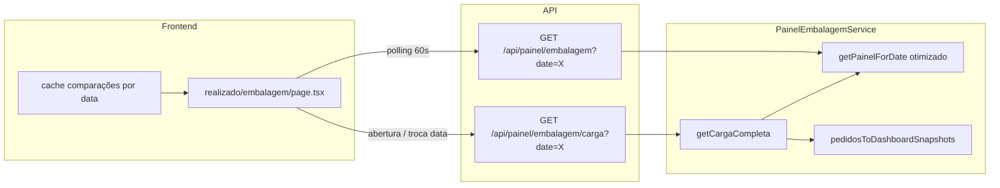
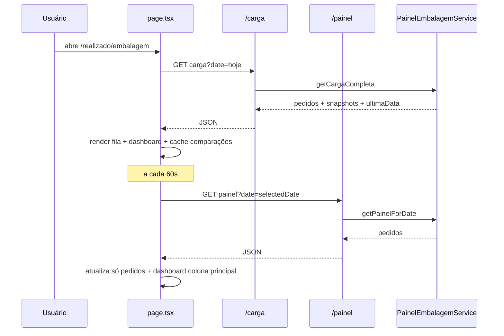

# Design: Realizado Embalagem — Performance da carga

**Data:** 2026-06-05  
**Status:** Aprovado pelo stakeholder  
**Rota:** `/realizado/embalagem`  
**Depende de:** B.3 (`PainelEmbalagemService`, `GET /api/painel/embalagem`)

## Contexto

A tela `/realizado/embalagem` ficou lenta após o dashboard lateral e a migração para leitura via Supabase. O gargalo **não** é uma query isolada lenta — é **volume de trabalho duplicado** entre frontend e backend.

### Diagnóstico (estado atual)

| Camada | Problema |
|--------|----------|
| `useLatestDataDate('embalagem')` | Até **7 requests sequenciais** ao painel completo |
| `loadEmbalagemFull` | **16 requests paralelos** por carga (1 principal + 1 D-7 + 14 dias anteriores) |
| Waterfall | Hook resolve data → dispara carga → skeleton até 16 responses |
| Polling 60s | Repete as **16 requests** com payload completo |
| `PainelEmbalagemService` | `findById` N+M por request; `clientePossuiEtiqueta` redundante (tipo já carregado traz `possuiEtiqueta`) |
| Payload comparação | 15 responses trazem pedidos + lotes + URLs de foto; dashboard só usa `caixas`, `pacotes`, `producaoUpdatedAt` |

**Estimativa:** carga inicial ≈ **23 roundtrips HTTP** × dezenas de queries Supabase cada.

### Objetivo

Reduzir tempo percebido em **abertura**, **troca de data** e **polling**, sem alterar comportamento visual ou regras do dashboard.

## Abordagem escolhida (C)

Endpoint unificado de carga + otimizações backend + refresh inteligente no frontend.

## Arquitetura



## API

### Novo: `GET /api/painel/embalagem/carga?date=YYYY-MM-DD`

Resposta única para montar fila + dashboard + data inicial.

```typescript
type DashboardSnapshot = {
  caixas: number;
  pacotes: number;
  pedidoCaixas: number;
  pedidoPacotes: number;
  producaoUpdatedAt?: string;
};

type CargaEmbalagemResponse = {
  date: string;
  /** Última data_producao com pedidos nos últimos 7 dias; null se nenhuma */
  ultimaDataComDados: string | null;
  pedidos: PainelPedidoEmbalagem[];
  comparacaoSemana: {
    date: string;
    items: DashboardSnapshot[];
  };
  comparacaoAnterior: {
    date: string | null;
    items: DashboardSnapshot[];
  };
};
```

**Regras de montagem:**

- `pedidos`: payload completo (igual ao `GET` atual) para a `date` solicitada.
- `comparacaoSemana.date` = `date` − 7 dias civis (ISO).
- `comparacaoAnterior.date` = data mais recente **estritamente anterior** a `date` com ≥1 pedido, buscando até 14 dias para trás; `null` se não houver.
- `comparacaoSemana.items` / `comparacaoAnterior.items`: snapshots derivados dos lotes (mesma lógica de `pedidosToDashboardItems`, sem URLs de foto).
- `ultimaDataComDados`: mesma semântica do hook `useLatestDataDate` — última `data_producao` com pedidos entre hoje e hoje−6; `null` se vazio (frontend mantém fallback “hoje”).

### Existente: `GET /api/painel/embalagem?date=YYYY-MM-DD`

**Mantido** para meta/embalagem, polling e compatibilidade. Recebe as **mesmas otimizações de backend** descritas abaixo (batch IDs, `possuiEtiqueta` do tipo).

## Backend — `PainelEmbalagemService`

### 1. Batch de nomes (todas as rotas)

Substituir loop `findById` por:

- `TiposEstoqueService.findByIds(ids: string[])` → 1 query `.in('id', ids)`
- `SupabaseProductService.findByIds(ids: string[])` → 1 query `.in('id', ids)`

`buildNameMaps` passa a usar batch. Em `getCargaCompleta`, unificar IDs de tipos/produtos das **3 datas** antes de uma única chamada batch.

### 2. Eliminar `clientePossuiEtiqueta` no painel

`possuiEtiqueta` vem de `TipoEstoqueDTO.possuiEtiqueta` já resolvido por `tipoEstoqueId` do pedido. Remover loop com cache + `estoqueService.clientePossuiEtiqueta` em `getPainelForDate`.

### 3. `getCargaCompleta(date: string)`

Ordem sugerida (queries mínimas):

1. `PedidoEmbalagemRepository.findUltimaDataComPedidos(lookbackDays: 7)` — 1 query
2. Calcular `dateSemana = date − 7`, resolver `dateAnterior` via `findDataAnteriorComPedidos(date, maxLookback: 14)` — 1 query
3. `listByDataProducao` para `[date, dateSemana, dateAnterior?]` — até 3 queries (ou 1 query `.in('data_producao', [...])` se preferir consolidar)
4. `listByPedidoEmbalagemIds` com IDs unificados das 3 datas — 1 query
5. Batch tipos + produtos — 2 queries
6. Montar `pedidos` completos só para `date`; montar snapshots para as outras duas datas

**Meta:** ~8–10 queries Supabase por carga completa (vs centenas hoje).

### 4. Novos métodos no repositório

```typescript
// PedidoEmbalagemRepository
findUltimaDataComPedidos(lookbackDays: number): Promise<string | null>
findDataAnteriorComPedidos(beforeDate: string, maxLookbackDays: number): Promise<string | null>
listByDatasProducao(dates: string[]): Promise<Map<string, PedidoEmbalagemRecord[]>> // opcional
```

### 5. Função de domínio compartilhada

Extrair de `pedidosToDashboardItems`:

- `pedidosToDashboardSnapshots(pedidos: PainelPedidoEmbalagem[]): DashboardSnapshot[]`

Usada no serviço (carga) e no adapter existente (frontend pode manter `pedidosToDashboardItems` delegando à mesma base ou consumir snapshots da API).

## Frontend — `realizado/embalagem/page.tsx`

### Carga inicial e troca de data

- Remover `useLatestDataDate` nesta página.
- Substituir `loadEmbalagemFull` por `loadCargaEmbalagem`:
  - 1 fetch `GET /api/painel/embalagem/carga?date=${selectedDate}`
  - Setar `pedidos`, `dashboardPrev`, `dashboardWeek`, `dateComparisonPrev`, e `selectedDate` inicial via `ultimaDataComDados` (só na **primeira** montagem, se usuário ainda não escolheu data manualmente).
- Remover loop de 14 fetches e fetch separado D-7.

### Estado de comparações (cache)

Guardar em ref ou state:

```typescript
comparacaoCache: {
  dateKey: string; // selectedDate usada na carga
  comparacaoSemana: { date, items };
  comparacaoAnterior: { date | null, items };
}
```

Atualizar cache apenas em carga completa (abertura / troca de data / pós-save se quiser manter dashboard coerente — ver nota abaixo).

### Polling (60s)

- Chamar só `GET /api/painel/embalagem?date=${selectedDate}`.
- Atualizar `pedidos` e recalcular `dashboardItems` via `pedidosToDashboardItems`.
- **Não** refetch comparaciones (D-7 / anterior) — permanecem do cache até `selectedDate` mudar.

### Pós-save produção

- Manter `refreshPainelData` chamando **só** `GET /api/painel/embalagem?date=X` (pedidos mudam; comparações históricas não).

### `EmbalagemDashboard`

Aceitar snapshots diretamente **ou** continuar recebendo `EmbalagemDashboardItem[]` — adapter no page mapeia `DashboardSnapshot → EmbalagemDashboardItem` (campos compatíveis; omitir cliente/produto se não usados nas métricas horárias).

Verificar: tabela horária usa `caixas`, `producaoUpdatedAt`; resumo usa `pedidoCaixas`. Snapshots incluem esses campos.

## Fluxo de dados



## Tratamento de erros

| Cenário | Comportamento |
|---------|---------------|
| Falha em `/carga` | Mensagem de erro visível; skeleton sai; não quebrar layout |
| Falha no polling | `console.error` silencioso (igual hoje); manter dados anteriores |
| `comparacaoAnterior.date === null` | Dashboard já trata — coluna “ontem” com traços + aviso |
| `/carga` ok mas `pedidos` vazios | Tela vazia válida; dashboard com zeros |
| Data inválida no query param | 400 com mensagem clara |

## Fora de escopo

- Otimizar `/meta/embalagem` (beneficia indiretamente do `getPainelForDate` otimizado).
- Alterar intervalo de polling (60s mantido).
- Cache HTTP/CDN no edge.
- Paginação ou lazy-load de acordeões.
- Mudar regras/métricas do `EmbalagemDashboard`.

## Critérios de aceite

1. Abertura da página: **1 request** de carga (não 23) até conteúdo visível.
2. Troca de data: **1 request** `/carga`.
3. Polling: **1 request** `/painel` por ciclo; sem refetch de D-7/anterior.
4. Totais do rodapé e resumo do dashboard batem com a versão anterior (mesma base de dados).
5. Colunas “ontem” e “semana passada” no dashboard idênticas à lógica atual (mesmas datas e agregações).
6. `GET /api/painel/embalagem` existente continua funcionando para meta/embalagem.
7. Testes unitários: batch maps, snapshots, `findDataAnteriorComPedidos`, `getCargaCompleta` (mock repos).

## Arquivos principais

| Arquivo | Mudança |
|---------|---------|
| `src/app/api/painel/embalagem/carga/route.ts` | Novo endpoint |
| `src/lib/services/painel-embalagem-service.ts` | `getCargaCompleta`, otimizar `getPainelForDate` |
| `src/data/embalagem/PedidoEmbalagemRepository.ts` | Queries de data |
| `src/lib/services/tipos-estoque-service.ts` | `findByIds` |
| `src/lib/services/products/supabase-product-service.ts` | `findByIds` |
| `src/domain/embalagem/painel-dashboard-adapter.ts` | `pedidosToDashboardSnapshots` |
| `src/domain/types/painel-embalagem.ts` | Tipos `DashboardSnapshot`, `CargaEmbalagemResponse` |
| `src/app/realizado/embalagem/page.tsx` | Carga unificada + cache + polling leve |
| `src/lib/services/painel-embalagem-service.test.ts` | Novos casos |

## Verificação manual

1. Abrir `/realizado/embalagem` — DevTools Network: 1 call `/carga`, fila aparece.
2. Trocar data — 1 call `/carga`.
3. Aguardar 60s — 1 call `/painel`, sem `/carga` nem múltiplos `?date=`.
4. Comparar totais cx/meta e tabela horária com versão anterior na mesma data.
5. Salvar produção no modal — lista atualiza; comparações estáveis.
