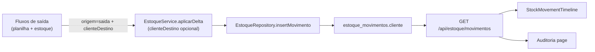

# Design: Cliente destino em movimentos de estoque (saídas)

**Data:** 2026-06-08  
**Status:** Aprovado pelo stakeholder  
**Depende de:** Fase A estoque/auditoria (`estoque_movimentos`, `GET /api/estoque/movimentos`)

## Contexto

Saídas de estoque registram o cliente destino na **planilha Google** (coluna `cliente`), mas o ledger `estoque_movimentos` no Supabase só guarda delta, saldo e `origem = 'saida'` — sem indicar para qual cliente foi a saída.

O operador consulta movimentos em dois lugares:

1. Modal **Histórico** no dashboard de estoque (`StockHistoryDialog` + `StockMovementTimeline`)
2. Página global **Auditoria de estoque** (`/estoque/auditoria`)

Sem o cliente no movimento, saídas no histórico são indistinguíveis entre si.

## Objetivos

1. Persistir o **nome do cliente destino** em `estoque_movimentos` quando a origem for saída.
2. Exibir o cliente no modal Histórico do dashboard.
3. Exibir o cliente na tabela da página Auditoria.
4. Manter `null` para demais origens (`embalagem`, `inventario`, `ajuste_manual`) e movimentos históricos já gravados.

## Decisões de produto (validadas)

| Tópico | Decisão |
|--------|---------|
| Campo no banco | `cliente text NULL` em `estoque_movimentos` |
| Valor gravado | Nome do cliente destino — mesmo texto da coluna `cliente` da planilha de saídas |
| Quando preencher | Apenas movimentos com `origem = 'saida'` (débito e estorno) |
| Parâmetro na API de serviço | `clienteDestino?: string` em `aplicarDelta` (evita colisão com `cliente` = tipo de estoque) |
| Movimentos antigos | Sem backfill — campo permanece `null` |
| Observação da saída | Fora de escopo |
| FK para `clientes` | Fora de escopo |
| Link para linha da planilha | Fora de escopo |

## Schema

```sql
ALTER TABLE estoque_movimentos
  ADD COLUMN IF NOT EXISTS cliente text NULL;
```

- Nullable, sem default.
- Texto livre (espelha planilha).
- Não indexado (volume baixo; filtros atuais são por tipo/produto/data).

## Arquitetura



### Cadeia de dados

| Camada | Mudança |
|--------|---------|
| `RegistrarMovimentoInput` | `clienteDestino?: string \| null` |
| `EstoqueMovimentoRecord` | `clienteDestino?: string \| null` |
| `RegistrarMovimentoByNomesInput` | `clienteDestino?: string` |
| `registrarMovimentoByIds` | repassa `clienteDestino` ao repository |
| `EstoqueRepository.insertMovimento` | persiste coluna `cliente` |
| `mapMovimentoRow` | mapeia `cliente` → `clienteDestino` no record |

**Nota de nomenclatura:** coluna SQL `cliente`; propriedade TypeScript `clienteDestino` no domínio para não confundir com `cliente` (tipo de estoque) em `aplicarDelta`.

## Call sites — passar `clienteDestino`

| Arquivo | Valor |
|---------|-------|
| `src/app/actions/stock-actions.ts` (`registerOutflowAction`) | `payload.clienteDestino` |
| `src/app/api/producao/saidas/route.ts` | `payload.cliente` |
| `src/app/api/public/saidas/route.ts` | `payload.cliente` |
| `src/app/api/producao/saidas/[rowId]/route.ts` | `row.cliente` (quando há delta de estoque) |
| `src/app/api/producao/saidas/[rowId]/partial/route.ts` | `cliente` da linha |
| `src/app/api/saidas/delete/[rowId]/route.ts` | `existingRow.cliente` (estorno) |
| `src/app/api/public/saidas/delete/route.ts` | `existingRow.cliente` (estorno) |

Demais call sites de `aplicarDelta` (embalagem, inventário, ajuste, novo estoque) **não** passam `clienteDestino`.

## UI

### Modal Histórico (`StockMovementTimeline`)

Quando `origem === 'saida'` e `clienteDestino` preenchido, exibir abaixo do delta:

```
Para: Nome do Cliente
```

- Label `Para:` em `text-xs text-gray-500`
- Nome em `font-semibold text-gray-700`
- Omitir linha quando `clienteDestino` for `null` ou vazio

### Auditoria (`/estoque/auditoria`)

Nova coluna **Cliente** entre **Produto** e **Delta** (ou após Origem — implementação escolhe posição lógica: após Produto).

- Valor preenchido: nome do cliente
- Vazio: `—` em `text-gray-400`

## API

`GET /api/estoque/movimentos` — sem mudança de query params. Campo `clienteDestino` incluído no JSON de cada movimento.

## Testes

1. Teste de integração `estoque-integration.test.ts`: `aplicarDelta` recebe `clienteDestino: 'Cliente A'` no POST e DELETE de saídas públicas.
2. Teste unitário do mapper ou repository (se existir padrão) confirmando persistência do campo.

## Fora de escopo

- Backfill de movimentos antigos
- Salvar observação da saída
- FK `cliente_id`
- Filtro por cliente na auditoria
- Drill-down para registro da planilha
