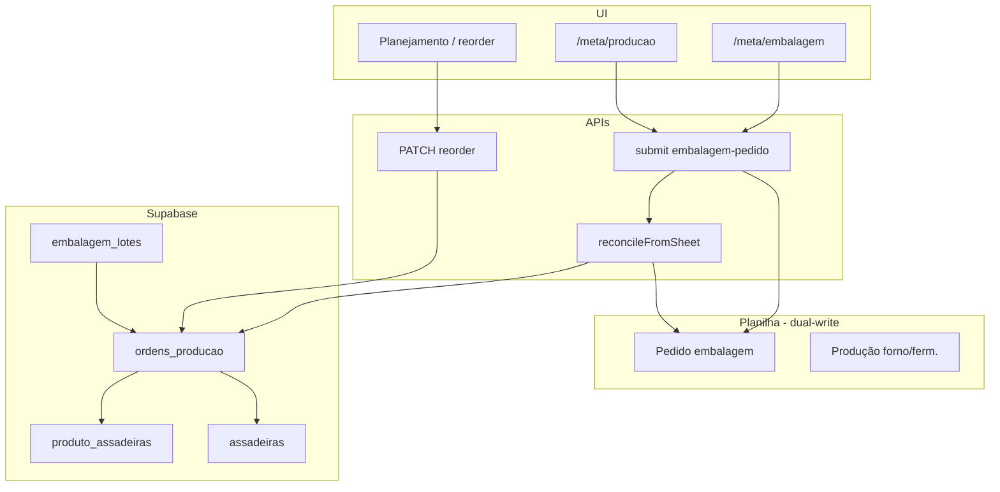

# Design: Ordens de Produção — unificação canônica em assadeiras

**Data:** 2026-06-09  
**Status:** Aprovado pelo stakeholder  
**Depende de:** Fase B.2 (`pedidos_embalagem`, reconcile, `embalagem_lotes.pedido_embalagem_id`)

## Contexto

A tabela `pedidos_embalagem` (Fase B.2) guarda a meta de embalagem em `caixas`, `pacotes`, `unidades` e `kg`, sincronizada com a planilha via dual-write + reconcile.

Fermentação e forno ainda operam na planilha (unidade **latas / LT**). A tabela `ordens_producao` existente (fila de etapas com `status`, `lote_codigo`, `qtd_planejada`) é **legada** e será removida.

**Objetivo:** evoluir `pedidos_embalagem` → `ordens_producao` como **fonte única de verdade** para embalagem, fermentação e forno, com quantidade canônica em **assadeiras (LT)** + tipo de assadeira, e conversões derivadas para embalagem.

## Decisões de produto (validadas)

| Tema | Decisão |
|------|---------|
| Abordagem | Evolução direta de `pedidos_embalagem` (renomear → `ordens_producao`) |
| Tabela legada `ordens_producao` | Remover após migração (`_ordens_producao_legacy` temporária) |
| Quantidade canônica | `assadeiras` (LT) + `assadeira_id` |
| Entrada do usuário | Sempre LT + seleção do tipo de assadeira |
| `status`, `lote_codigo`, `prioridade`, `pedido_id` | Não migrar (legado) |
| `ordem_planejamento` | Sim — manual (drag-and-drop), escopo por `data_producao` |
| Chave única | Adiciona `assadeira_id` à chave B.2 |
| Duplicata na planilha | Ordens separadas se `assadeira_id` diferente; mesma chave + assadeira → somar `assadeiras` |
| Fator de conversão | `produto_assadeiras.unidades_por_assadeira` ?? `assadeiras.unidades_por_assadeira` |
| Rename em `assadeiras` | `numero_buracos` → `unidades_por_assadeira` |
| Nullable | `produto_assadeiras.unidades_por_assadeira` e `assadeiras.unidades_por_assadeira` permitem `NULL` |
| Derivados ao salvar | `unidades` = assadeiras × fator; `caixas` = `floor(unidades / box_units)` se `box_units`; `pacotes`/`kg` = 0 (avaliar futuramente) |
| `produtos.unidades_assadeira` | Deprecar no código novo |

## Fora de escopo (esta spec)

- Desligar dual-write / planilhas (fase futura D.5)
- Preencher `pacotes` e `kg` derivados
- Migrar dados de `_ordens_producao_legacy` (tabela descartada)
- Novo modelo de etiquetas (congelado, lote)

## Schema

### Migration: `assadeiras`

```sql
ALTER TABLE assadeiras
  RENAME COLUMN numero_buracos TO unidades_por_assadeira;

ALTER TABLE assadeiras
  ALTER COLUMN unidades_por_assadeira DROP NOT NULL;
```

| Coluna | Nullable | Papel |
|--------|----------|-------|
| `unidades_por_assadeira` | Sim | Default do tipo de assadeira; usado quando override do produto é `NULL` |

### Migration: `produto_assadeiras`

```sql
ALTER TABLE produto_assadeiras
  ALTER COLUMN unidades_por_assadeira DROP NOT NULL;
```

| Coluna | Nullable | Papel |
|--------|----------|-------|
| `unidades_por_assadeira` | Sim | Override por produto; `NULL` → usa default da assadeira |

**Validação ao salvar ordem:**

```
fator = produto_assadeiras.unidades_por_assadeira
     ?? assadeiras.unidades_por_assadeira

se fator IS NULL ou fator <= 0 → HTTP 400
```

### Tabela `ordens_producao` (evolução de `pedidos_embalagem`)

| Coluna | Tipo | Notas |
|--------|------|-------|
| `id` | uuid PK | mantém |
| `created_at`, `updated_at` | timestamptz | mantém |
| `data_producao` | date | mantém |
| `data_fabricacao_etiqueta` | date | mantém |
| `tipo_estoque_id` | uuid FK → `tipos_estoque` | mantém |
| `produto_id` | uuid FK → `produtos` | mantém |
| `observacao` | text NOT NULL DEFAULT `''` | mantém |
| `assadeira_id` | uuid FK → `assadeiras` NOT NULL | **novo** |
| `assadeiras` | numeric NOT NULL | **novo** — quantidade canônica (LT) |
| `ordem_planejamento` | integer NOT NULL | **novo** — único por `data_producao` |
| `unidades` | integer NOT NULL DEFAULT 0 | derivado ao salvar |
| `caixas` | integer NOT NULL DEFAULT 0 | derivado ao salvar |
| `pacotes` | integer NOT NULL DEFAULT 0 | 0 por enquanto |
| `kg` | numeric(12,3) NOT NULL DEFAULT 0 | 0 por enquanto |

**Constraint única:**

```sql
UNIQUE (data_producao, data_fabricacao_etiqueta, tipo_estoque_id, produto_id, observacao, assadeira_id)
```

**Índices sugeridos:**

- `(data_producao DESC)` — janela reconcile
- `(data_producao, ordem_planejamento)` — fila do dia

### Ordem de migração do banco

1. `assadeiras`: rename + nullable
2. `produto_assadeiras`: nullable
3. Renomear `ordens_producao` legada → `_ordens_producao_legacy`
4. Renomear `pedidos_embalagem` → `ordens_producao`
5. `ALTER` novas colunas + atualizar UNIQUE
6. Renomear `embalagem_lotes.pedido_embalagem_id` → `ordem_producao_id`
7. Backfill registros existentes
8. Dropar `_ordens_producao_legacy`

### `embalagem_lotes`

| Antes | Depois |
|-------|--------|
| `pedido_embalagem_id` → `pedidos_embalagem` | `ordem_producao_id` → `ordens_producao` |

Link por chave natural permanece; script `link-embalagem-lotes-pedidos.ts` adaptado.

### `producao_etapas_log`

- `ordem_producao_id` passa a referenciar a nova `ordens_producao`
- Sem coluna `status` na ordem; progresso apenas no log de etapas

## Conversões e fluxo de dados

### Ao salvar (create/update)

```
1. Validar produto_id + assadeira_id (assadeira ∈ produto_assadeiras do produto)
2. fator = produto_assadeiras.unidades_por_assadeira ?? assadeiras.unidades_por_assadeira
3. unidades = assadeiras × fator
4. caixas   = box_units > 0 ? floor(unidades / box_units) : 0
5. pacotes  = 0
6. kg       = 0
7. Persistir
```

A UI edita apenas `assadeiras` + `assadeira_id`. Derivados são recalculados a cada save.

### Leitura por estação

| Estação | Campo principal | Exibição |
|---------|-----------------|----------|
| Massa / Fermentação / Forno | `assadeiras` | LT (ex.: "5 LT c/ 24") |
| Embalagem | `caixas`, `unidades` | caixas quando `box_units`; unidades sempre |
| Planejamento | `assadeiras`, `ordem_planejamento` | LT + posição no dia |

### `ordem_planejamento`

- Escopo: por `data_producao`
- Definido manualmente (drag-and-drop)
- API: `PATCH` reorder com `{ dataProducao, orderedIds[] }`
- Novas ordens: `max(ordem_planejamento) + 1` no dia

### Validações

| Situação | Comportamento |
|----------|---------------|
| Produto sem linha em `produto_assadeiras` | 400 |
| `assadeira_id` não pertence ao produto | 400 |
| `assadeiras` ≤ 0 | 400 |
| Fator efetivo nulo ou ≤ 0 | 400 |
| Duplicata na chave única (reconcile) | Upsert com soma de `assadeiras` |

## Reconcile e planilha

### Embalagem (dual-write mantido)

```
Para cada linha da planilha (janela data_producao ±3 dias):
  1. Resolver produto_id + tipo_estoque_id
  2. Resolver assadeira_id (coluna planilha ou default do produto)
  3. Converter → assadeiras (unidades ou caixas → unidades → assadeiras)
  4. Agrupar por chave natural + assadeira_id; somar assadeiras
  5. Recalcular unidades/caixas derivados
  6. Upsert + delete órfãos (mesmo algoritmo B.2)
```

### Fermentação / forno (ingestão futura)

Mesma tabela. Planilha já usa LT:

```
assadeiras = coluna LT
assadeira_id = planilha ou default do produto
data_fabricacao_etiqueta = data_producao quando ausente
```

## Backfill de dados existentes

Para registros atuais de `pedidos_embalagem` sem `assadeira_id`/`assadeiras`:

1. Primeira assadeira em `produto_assadeiras` do `produto_id`
2. Calcular `assadeiras` reversamente:
   - `unidades > 0` → `assadeiras = unidades / fator`
   - senão `caixas > 0` + `box_units` → unidades → assadeiras
   - senão `assadeiras = 0` (revisão manual)
3. `ordem_planejamento` = sequencial por `data_producao` ordenado por `created_at`

Ordens sem assadeira configurada → relatório de backfill (não bloqueia migration).

## Arquitetura



## Código impactado

| Artefato | Mudança |
|----------|---------|
| `CREATE_PEDIDOS_EMBALAGEM_TABLES.sql` | Substituído por migration D.1 |
| `PedidoEmbalagemRepository` | → `OrdemProducaoRepository` |
| `pedido-key.ts` | Chave + `assadeira_id` |
| `map-sheet-rows-to-pedidos.ts` | Normalizar LT/assadeira |
| `production-conversions.ts` | Fator efetivo da ordem |
| `CreatePedidoModal`, `/meta/producao` | Input LT + seletor assadeira |
| `sync-pedidos-embalagem-from-sheet.ts` | Renomear + conversão |
| `link-embalagem-lotes-pedidos.ts` | `ordem_producao_id` |
| `types/database.ts` | `npm run gen:types` |

## Fases de rollout

| Fase | Escopo |
|------|--------|
| D.1 — Schema | Migrations completas |
| D.2 — Domínio | Repositório, conversões, reconcile |
| D.3 — UI meta | LT + assadeira + reorder |
| D.4 — Leitura | Painéis leem `ordens_producao` |
| D.5 — Cleanup | Deprecar `unidades_assadeira`; desligar planilha |

## Critérios de aceite

### D.1 + D.2

- [ ] `unidades_por_assadeira` nullable em `assadeiras` e `produto_assadeiras`
- [ ] `numero_buracos` renomeado para `unidades_por_assadeira`
- [ ] `pedidos_embalagem` → `ordens_producao` com novas colunas
- [ ] UNIQUE inclui `assadeira_id`
- [ ] Save deriva `unidades` + `caixas`; `pacotes`/`kg` = 0
- [ ] Reconcile normaliza planilha → assadeiras
- [ ] `embalagem_lotes.ordem_producao_id` funcional
- [ ] Backfill com relatório de ordens pendentes
- [ ] `_ordens_producao_legacy` removida

### D.3

- [ ] Criar/editar: LT + dropdown assadeiras do produto
- [ ] Reorder drag-and-drop por dia
- [ ] Preview de unidades/caixas na UI
