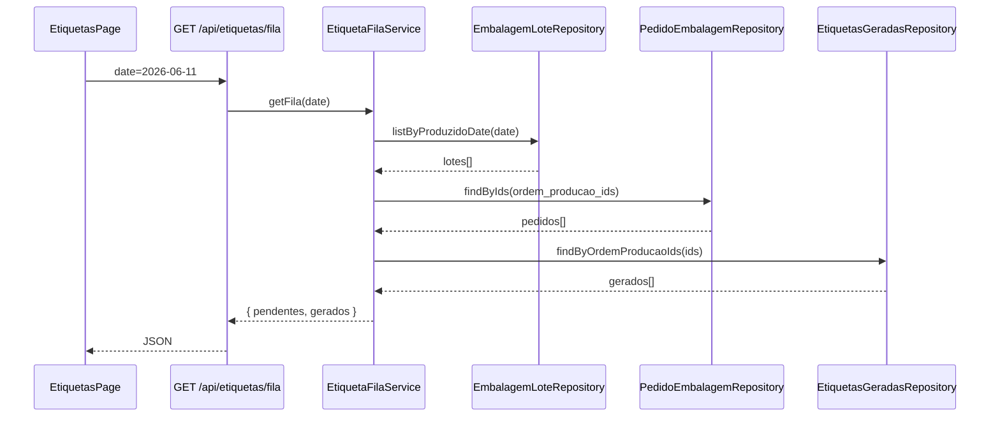

# Design: Tela de Geração de Etiquetas

**Data:** 2026-06-11  
**Status:** Aprovado pelo stakeholder (brainstorming)  
**Escopo:** Hub de etiquetas + controle de geração + config de tipos de estoque

## Contexto

Após a embalagem, as etiquetas são impressas e coladas nas caixas. Hoje existe um botão na tela **Meta/Embalagem** (`/meta/embalagem`) que abre o `EtiquetaModal` e chama `/api/etiqueta/gerar`. Esse fluxo está no lugar errado: etiqueta é uma etapa **posterior** à embalagem, feita por uma pessoa no **computador da área de estoque**.

A geração atual depende de regras espalhadas:

- `tipos_estoque`: `congelado`, `possui_etiqueta`
- `clientes`: `tem_validade_congelado_na_etiqueta`, `tem_texto_indicando_congelado_na_etiqueta` (lookup por nome)
- Hardcode em `EtiquetaModal` (ex.: "HB Brioche 50g 10cm" → "HB Smash Brioche 50g 10cm")
- Defaults 21/90 dias no próprio modal
- Dados do produto (código de barras, peso, un/caixa) ainda lidos da **planilha Google** em `/api/etiqueta/gerar`

**Objetivo:** tela dedicada `/etiquetas` com UX desktop impecável, fila de pedidos embalados, geração manual para casos especiais, controle binário "já gerou / pendente", e configuração centralizada em `/config/tipos-estoque`.

## Restrições explícitas (stakeholder)

| Restrição | Detalhe |
|-----------|---------|
| **Não alterar fluxo atual** | `EtiquetaModal`, `/api/etiqueta/gerar` e botão em `/meta/embalagem` permanecem **intocados** |
| **Tela nova, UI nova** | `/etiquetas` é uma implementação separada; geração HTML continua via API existente |
| **UI/UX na implementação** | Aplicar skill **ui-ux-pro-max** + padrão visual Valepan (configs / EasyDash) na nova tela apenas |

## Decisões de produto (validadas)

| Tema | Decisão |
|------|---------|
| Unidade do card | **Pedido/meta de embalagem** (`ordens_producao`) |
| Entra na fila quando | ≥1 `embalagem_lotes` com `produzido_em` na data selecionada |
| Usuário / dispositivo | Desktop no computador da área de estoque |
| Meta / realizado no card | **Indicativo visual** — sem campo de quantidade no sistema |
| Quantidade impressa | Pessoa define na impressora; sistema só sugere via texto (ex.: "≈50 etiquetas") |
| Controle | Binário: **pendente** vs **já gerou** |
| Marca como gerado | Ao clicar **Gerar e imprimir** (abre HTML) |
| Reimpressão | **Livre** na aba "Já gerados" — não altera status nem cria novo registro |
| Janela de datas | **Hoje** por padrão + seletor de data + chips Hoje/Ontem |
| Geração manual | **Essencial na v1** — botão sempre visível no header |
| Config de regras | **CRUD** `tipos_estoque` + centralizar regras; remover hardcodes |
| Abordagem de navegação | **Hub dedicado** `/etiquetas` (não integrar em Realizado/Embalagem) |
| Fluxo legado | **Mantido** — `/meta/embalagem` + `EtiquetaModal` continuam funcionando como hoje |

## Ordenação da fila

**Aba Pendentes:**

1. Pedidos **com lote** definido primeiro; sem lote depois
2. Dentro de cada grupo: `created_at` do pedido ASC (mais antigo primeiro)
3. Apenas pedidos cujo tipo de estoque tem `possui_etiqueta = true`

**Aba Já gerados:** mesma ordenação, com badge "Gerado às HH:mm".

## Fora de escopo (v1)

- Controle de quantidade de cópias impressas
- Histórico avançado com filtros (além de pendentes/gerados do dia)
- Integração da fila em `/realizado/embalagem`
- Alterações em `EtiquetaModal`, `/api/etiqueta/gerar` ou botão em `/meta/embalagem`
- Migração da planilha Google na API legada (fica para depois, se necessário)

---

## Schema

### Nova tabela `etiquetas_geradas`

Registro de que a etiqueta foi gerada — **separado** de `embalagem_lotes`.

| Coluna | Tipo | Obrigatório | Notas |
|--------|------|-------------|-------|
| `id` | uuid | Sim | PK, default `gen_random_uuid()` |
| `ordem_producao_id` | uuid | Não | FK → `ordens_producao.id`; preenchido no fluxo da fila |
| `produto_id` | uuid | Sim | FK → `produtos.id` |
| `tipo_estoque_id` | uuid | Sim | FK → `tipos_estoque.id` |
| `data_fabricacao` | date | Sim | Data impressa na etiqueta |
| `modo` | text | Sim | `'pedido'` \| `'manual'` |
| `gerado_em` | timestamptz | Sim | default `now()` |
| `gerado_por` | uuid | Não | FK → `usuarios.id` se sessão disponível |
| `created_at` | timestamptz | Sim | default `now()` |

**Constraints:**

- `UNIQUE (ordem_producao_id)` WHERE `ordem_producao_id IS NOT NULL` — um registro por pedido na fila
- Fluxo manual: sem unique; múltiplas gerações permitidas (histórico)

**RLS:** habilitado. Padrão do projeto:

- SELECT: usuários autenticados (`USING (true)`)
- INSERT: autenticados (`WITH CHECK (true)`)
- UPDATE/DELETE: admins (`USING ((SELECT is_admin()))`)

### Alterações em `tipos_estoque`

| Coluna nova | Tipo | Default | Descrição |
|-------------|------|---------|-----------|
| `mostrar_texto_congelado` | boolean | `false` | Exibe texto "CONGELADO" na etiqueta |

Colunas existentes mantidas: `nome`, `ativo`, `possui_etiqueta`, `congelado` (layout 2 colunas vs 3 — já existe; passa a ser a **única** fonte para isso, substituindo lookup em `clientes`).

### Alterações em `produtos`

| Coluna nova | Tipo | Default | Descrição |
|-------------|------|---------|-----------|
| `nome_etiqueta` | text | null | Nome na etiqueta; null → usa `nome` |
| `dias_validade_ambiente` | integer | `21` | Dias validade temperatura ambiente |
| `dias_validade_congelado` | integer | `90` | Dias validade congelado |

Dados de etiqueta já existentes no Supabase (substituem planilha):

- `unit_barcode` → código de barras
- `unit_weight` → peso líquido unitário
- `box_units` → unidades por caixa
- `package_units` → unidades por pacote

### Migração de dados

1. Copiar `clientes.tem_texto_indicando_congelado_na_etiqueta` → `tipos_estoque.mostrar_texto_congelado` onde `tipos_estoque.nome` = `clientes.nome_fantasia` (match case-insensitive)
2. Onde `clientes.tem_validade_congelado_na_etiqueta = true` e `tipos_estoque.congelado = false`, atualizar `tipos_estoque.congelado = true` (mesmo critério de nome)
3. Script one-off para `nome_etiqueta` do hardcode "HB Brioche 50g 10cm" → "HB Smash Brioche 50g 10cm" no produto correspondente

---

## Arquitetura

### Estrutura de arquivos (novos)

```
src/app/etiquetas/
  page.tsx                          # Server Component
  EtiquetasPageClient.tsx           # Abas, date picker, grid de cards

src/components/Etiquetas/
  EtiquetaPedidoCard.tsx            # Card com meta/realizado + CTA
  EtiquetaGerarModal.tsx            # Modal refatorado (fila + manual)
  EtiquetaManualFormFields.tsx      # Campos editáveis do modo manual
  EtiquetaFilaSkeleton.tsx          # Loading state

src/app/config/tipos-estoque/
  page.tsx
  TiposEstoqueClient.tsx

src/components/TiposEstoque/
  TiposEstoqueTable.tsx
  TiposEstoqueMobileList.tsx
  TipoEstoqueModal.tsx

src/app/api/etiquetas/
  fila/route.ts                     # GET fila por data
  registrar/route.ts                # POST marca como gerado (após impressão)

src/data/etiquetas/
  EtiquetasGeradasRepository.ts

src/domain/etiquetas/
  etiqueta-fila-types.ts
  etiqueta-fila-sorter.ts
  etiqueta-fila-sorter.test.ts
  etiqueta-resolver.ts              # Regras centralizadas (tipo + produto)
  etiqueta-resolver.test.ts

src/lib/services/
  etiqueta-fila-service.ts
  tipos-estoque-admin-service.ts      # CRUD config

src/app/actions/
  tipos-estoque-actions.ts
```

### Arquivos modificados

| Arquivo | Mudança |
|---------|---------|
| `src/components/Navigation.tsx` | Link "Etiquetas" após "Realizado: Embalagem" |
| `src/components/Config/ConfigNav.tsx` | Item "Tipos de estoque" |
| `types/database.ts` | Tipos gerados após migration |

**Sem alteração:** `src/components/EtiquetaModal.tsx`, `src/app/api/etiqueta/gerar/route.ts`, `src/app/meta/embalagem/page.tsx`

### Fluxo de dados — fila



### Montagem do card

Reutilizar `buildPainelPedido` / `PainelEmbalagemService` para obter `pedido`, `produzido`, `unidade`, `lote`, `cliente` (nome do tipo estoque), `produto`.

**Texto indicativo de quantidade:** quando `unidade === 'cx'` e `produzido.caixas > 0`, exibir helper `≈{produzido.caixas} etiquetas` abaixo de meta/realizado. Para `pct`/`un`/`kg`, adaptar label (ex.: "≈30 pacotes") sem obrigar impressão.

---

## UI — `/etiquetas`

### Layout (desktop-first)

- Max-width ~`max-w-6xl`, padding confortável
- Header: título "Etiquetas", date picker, chips **Hoje** / **Ontem**
- CTA secundário no header: **+ Gerar etiqueta manual** (`min-h-11`, sempre visível)
- Abas: `Pendentes (N)` | `Já gerados (N)`
- Grid responsivo: 1 col mobile, 2–3 cols desktop

### Card (`EtiquetaPedidoCard`)

| Elemento | Conteúdo |
|----------|----------|
| Título | Nome do produto |
| Subtítulo | Tipo de estoque |
| Badge | Lote (número) ou "Sem lote" |
| Quantidades | `Meta: X cx · Realizado: Y cx` (unidade do pedido) |
| Hint | `≈Y etiquetas` quando aplicável |
| Meta linha | Horário do primeiro lote do dia (opcional) |
| Ação primária | "Gerar etiqueta" ou "Reimprimir" |

### Estados vazios

- **Pendentes vazio:** "Nenhuma embalagem com etiqueta pendente nesta data."
- **Gerados vazio:** "Nenhuma etiqueta gerada nesta data."

### Estilo visual

Alinhar ao design system das configs Valepan:

- Fundo `gray-50`, cards brancos com borda sutil
- CTA primário `gray-900` / hover `gray-800`
- Material Icons (sem emoji)
- Contraste WCAG AA, focus rings visíveis
- Botões e alvos ≥ 44px

---

## Modal — `EtiquetaGerarModal` (componente NOVO)

Componente **separado** do `EtiquetaModal` legado. Tema **claro** alinhado a `/config/*` (não copiar o dark theme do modal antigo).

### Modo fila (card clicado)

| Campo | Editável |
|-------|----------|
| Produto | Não |
| Tipo de estoque | Não |
| Data de fabricação | Não |
| Lote | Não (calculado de `data_fabricacao`) |
| Nome na etiqueta | Sim |
| Dias validade ambiente | Sim (pré-preenchido do produto) |
| Dias validade congelado | Sim (pré-preenchido do produto) |
| Layout congelado | Derivado de `tipos_estoque` (somente leitura ou toggle se regra permitir override — **v1: somente leitura**) |

### Modo manual

| Campo | Editável |
|-------|----------|
| Produto | Sim (autocomplete) |
| Tipo de estoque | Sim (select, só `possui_etiqueta = true`) |
| Data de fabricação | Sim (date picker → recalcula lote) |
| Demais | Igual modo fila |

### Ação "Gerar e imprimir"

1. `POST /api/etiqueta/gerar` — **API legada, inalterada** (mesmo payload que `EtiquetaModal`)
2. Client abre blob HTML em nova aba
3. `POST /api/etiquetas/registrar` — marca em `etiquetas_geradas` (`modo = pedido` ou `manual`)
4. Fecha modal; atualiza fila (refetch)

Se o passo 1 falhar, não registra. Se o passo 3 falhar após impressão aberta, exibir aviso com opção de tentar registrar de novo.

### Reimpressão (aba Já gerados)

- Chama apenas `POST /api/etiqueta/gerar` — **sem** novo registro em `etiquetas_geradas`

---

## Regras centralizadas — `etiqueta-resolver`

Entrada: `produto_id`, `tipo_estoque_id`, overrides opcionais do modal.

| Saída | Fonte |
|-------|-------|
| `congelado` (layout 2 colunas) | `tipos_estoque.congelado` |
| `mostrarTextoCongelado` | `tipos_estoque.mostrar_texto_congelado` |
| `nomeEtiqueta` | `produtos.nome_etiqueta ?? produtos.nome` |
| `diasValidade` | modal override ?? `produtos.dias_validade_ambiente` |
| `diasValidadeCongelado` | modal override ?? `produtos.dias_validade_congelado` |
| `lote` | `loteFromDataFabricacaoEtiqueta(data_fabricacao)` |
| Dados de barras/peso | API legada `/api/etiqueta/gerar` (inalterada) |

O **novo modal** usa `etiqueta-resolver` para **pré-preencher** campos exibidos ao usuário. A submissão final repassa os mesmos campos que o `EtiquetaModal` envia hoje (`produto`, `cliente`, `dataFabricacao`, `lote`, flags de validade, etc.).

**Legado:** `/api/clientes/flags-etiqueta` continua sendo usado pelo `EtiquetaModal` antigo. A nova tela lê regras de `tipos_estoque` para pré-preenchimento.

---

## Config — `/config/tipos-estoque`

Padrão de `/config/regras-assadeiras` e `/config/produtos`:

| Coluna | Label UI |
|--------|----------|
| `nome` | Nome |
| `ativo` | Ativo |
| `possui_etiqueta` | Possui etiqueta |
| `congelado` | Congelado (layout simplificado — 2 colunas) |
| `mostrar_texto_congelado` | Mostrar texto "CONGELADO" |

- Tabela desktop + lista mobile
- Modal criar/editar
- Toast de feedback
- Filtro ativo/inativo via query param `?status=`

---

## APIs

### `GET /api/etiquetas/fila?date=YYYY-MM-DD`

```typescript
type EtiquetaFilaItem = {
  pedidoEmbalagemId: string;
  produto: string;
  produtoId: string;
  tipoEstoque: string;
  tipoEstoqueId: string;
  dataFabricacao: string;
  lote: number | null;
  pedido: Quantidade;
  produzido: Quantidade;
  unidade: 'cx' | 'pct' | 'un' | 'kg';
  geradoEm?: string; // ISO, só na aba gerados
  primeiroLoteHorario?: string; // HH:mm
};

type EtiquetaFilaResponse = {
  date: string;
  pendentes: EtiquetaFilaItem[];
  gerados: EtiquetaFilaItem[];
};
```

### `POST /api/etiquetas/registrar`

Body: `ordem_producao_id?`, `produto_id`, `tipo_estoque_id`, `data_fabricacao`, `modo`.

Response: `{ ok: true }`. Upsert quando `modo = pedido` (unique por `ordem_producao_id`).

**Geração HTML:** continua em `POST /api/etiqueta/gerar` (legado, sem mudanças).

---

## Tratamento de erros

| Cenário | Comportamento |
|---------|---------------|
| Produto sem código de barras | Gerar etiqueta sem imagem de barras (comportamento atual) |
| Tipo sem `possui_etiqueta` | Não aparece na fila; bloquear no manual com mensagem clara |
| Pedido sem lote | Aparece na fila (grupo sem lote), lote calculado na geração se `data_fabricacao` existir |
| Falha ao registrar `etiquetas_geradas` após gerar HTML | **Não** abrir impressão; retornar erro (transação ou ordem: persist antes de responder) |
| Data sem embalagens | Estado vazio amigável |

---

## Testes

| Área | Casos |
|------|-------|
| `etiqueta-fila-sorter` | Ordenação lote primeiro + created_at |
| `etiqueta-resolver` | Regras tipo + produto; overrides do modal |
| `etiqueta-fila-service` | Filtro por data, split pendentes/gerados, `possui_etiqueta` |
| `etiqueta-geracao-service` | Cálculo validade, peso líquido, lote |
| API integration | POST gerar cria registro; reimprimir não duplica |

---

## Checklist de entrega

- [ ] Migration SQL + RLS `etiquetas_geradas`
- [ ] Migration colunas `tipos_estoque` e `produtos`
- [ ] Script migração flags clientes → tipos_estoque
- [ ] `/etiquetas` funcional (fila + manual + abas) com ui-ux-pro-max
- [ ] `/config/tipos-estoque` CRUD
- [ ] `EtiquetaModal` e `/meta/embalagem` **inalterados**
- [ ] Navegação atualizada (link para `/etiquetas`)
