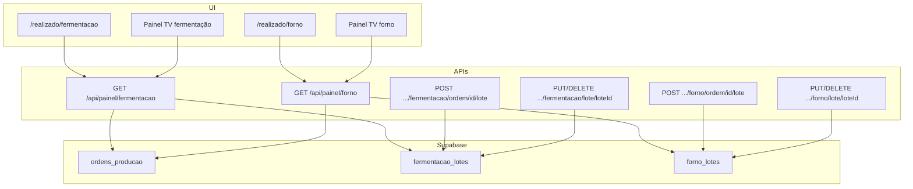

# Design: Fermentação e Forno — Desligar planilha

**Data:** 2026-06-17  
**Status:** Aprovado pelo stakeholder  
**Depende de:** `2026-06-09-ordens-producao-design.mdx`, `2026-06-03-embalagem-lotes-realizado-design.mdx`, `2026-06-09-embalagem-desligar-planilha-design.mdx`, `2026-06-17-ordens-producao-tela-design.mdx`

## Contexto

Fermentação e forno operam 100% na planilha Google Sheets:

- **Leitura:** `GET /api/painel/fermentacao` e `GET /api/painel/forno` leem linhas por `data_producao`
- **Escrita:** `PUT /api/producao/fermentacao|forno/[rowId]` sobrescreve produção na linha; forno tem `POST .../partial` que divide linhas
- **Fotos:** Drive + colunas da planilha indexadas por `rowId`
- **Meta:** `/meta/producao` grava pedidos na planilha de forno via `POST /api/submit/forno-pedido`

Embalagem já migrou para `ordens_producao` + `embalagem_lotes` com corte total da planilha (Fase C). A tela `/ordens-producao` é a meta canônica no Supabase para todas as estações.

**Objetivo:** migrar fermentação e forno para o mesmo modelo — meta em `ordens_producao`, realizado em tabelas de lotes — com corte total da planilha, UI hierárquica igual embalagem, sem backfill histórico.

## Decisões de produto (validadas)

| Tema | Decisão |
|------|---------|
| Meta | `ordens_producao` (planejamento em `/ordens-producao`) |
| Realizado | `fermentacao_lotes` + `forno_lotes` (append por lote) |
| Modelo de escrita | Cada confirmação cria um **lote**; `produzido` = `SUM(lotes)` |
| UI realizado | Hierárquica igual embalagem: card pai + expand + botão **Novo lote** |
| Planilha | **Congelada** — sem leitura nem escrita pelo app |
| Histórico | Tabelas vazias no go-live; popular **somente a partir do deploy** |
| `/meta/producao` | **Remover** rota, menu, links na home e APIs associadas |
| Lotes | Editar e excluir como embalagem |
| Quantidade no lote | Com assadeira na ordem → só `assadeiras` (LT); sem assadeira → só `unidades` |
| Escopo | Realizado + painéis TV + WhatsApp + limpeza de rotas legadas |
| Abordagem técnica | Espelhar padrão embalagem (duas tabelas, serviços separados, helpers compartilhados) |
| Estoque | Sem movimentação de estoque (diferente de embalagem) |

## Fora de escopo

- Resfriamento e saídas
- Backfill/importação da planilha para as novas tabelas
- Unificar `embalagem_lotes` / `fermentacao_lotes` / `forno_lotes` em tabela única
- Migrar `/meta/embalagem` (já em transição para `/ordens-producao`)
- Export planilha banco → Google Sheets
- Dual-write temporário

---

## Schema

### Enum `producao_lote_modo`

```sql
CREATE TYPE producao_lote_modo AS ENUM ('parcial', 'substituicao');
```

- `parcial` — lote criado via botão Novo lote ou salvamento parcial no modal
- `substituicao` — edição de lote existente (PUT)

Sem valor `importado` — não haverá job de backfill.

### Tabela `fermentacao_lotes`

| Coluna | Tipo | Notas |
|--------|------|-------|
| `id` | uuid PK | `gen_random_uuid()` |
| `created_at` | timestamptz | `now()` |
| `produzido_em` | timestamptz | `now()` |
| `modo` | `producao_lote_modo` | NOT NULL |
| `ordem_producao_id` | uuid FK → `ordens_producao` | NOT NULL |
| `assadeiras` | numeric(12,3) | DEFAULT 0 — preenchido quando ordem tem assadeira |
| `unidades` | integer | DEFAULT 0 — preenchido quando ordem sem assadeira |
| `foto_url` | text | nullable |
| `foto_id` | text | nullable |
| `foto_uploaded_at` | timestamptz | nullable |
| `producao_anterior` | jsonb | nullable — `{ assadeiras, unidades }` em edição |

**Índices:**

- `(ordem_producao_id)`
- `(produzido_em DESC)`

### Tabela `forno_lotes`

Estrutura **idêntica** a `fermentacao_lotes` (tabela separada para evolução independente, alinhado a `embalagem_lotes`).

### RLS

Mesmo padrão do projeto:

- RLS habilitado em ambas as tabelas
- SELECT: usuários autenticados (`USING (true)`)
- INSERT/UPDATE/DELETE: via `service_role` no backend
- Políticas usam `(SELECT auth.uid())` e `(SELECT is_admin())` quando aplicável

Scripts: `FERMENTACAO_LOTES_RLS.sql`, `FORNO_LOTES_RLS.sql`

---

## Arquitetura



### Camadas por etapa

| Camada | Fermentação | Forno |
|--------|-------------|-------|
| Repository | `FermentacaoLoteRepository` | `FornoLoteRepository` |
| Service | `fermentacao-lote-service` | `forno-lote-service` |
| Painel | `painel-fermentacao-service` | `painel-forno-service` |
| Daily summary | `FermentacaoDailySummaryService` (DB) | `FornoDailySummaryService` (DB) |

### Domínio compartilhado (`src/domain/producao-etapa/`)

- `somarQuantidadesEtapa` — agrega lotes por ordem
- `derivarUnidadeEtapa` — escalar `aProduzir` / `produzido` para cards
- `buildPainelOrdem` — monta `PainelOrdemEtapa` a partir de ordem + lotes
- `resolveModoQuantidadeLote` — `assadeiras` vs `unidades` conforme `ordem.assadeiraId`

---

## API

### `GET /api/painel/fermentacao?date=YYYY-MM-DD`  
### `GET /api/painel/forno?date=YYYY-MM-DD`

Substituem leitura da planilha. TV e realizado consomem a **mesma** resposta.

```typescript
type PainelEtapaResponse = {
  date: string;
  ordens: PainelOrdemEtapa[];
};

type PainelOrdemEtapa = {
  ordemProducaoId: string;
  produto: string;
  tipoEstoque: string;
  observacao: string;
  dataProducao: string;
  modoQuantidade: 'assadeiras' | 'unidades';
  pedido: { assadeiras: number; unidades: number };
  produzidoBreakdown: { assadeiras: number; unidades: number };
  unidade: 'lt' | 'un';
  aProduzir: number;
  produzido: number; // escalar derivado de produzidoBreakdown
  assadeiraNome?: string;
  lotes: PainelLoteEtapa[];
};

type PainelLoteEtapa = {
  loteId: string;
  modo: 'parcial' | 'substituicao';
  assadeiras: number;
  unidades: number;
  produzidoEm: string;
  fotoUrl?: string;
  fotoId?: string;
  fotoUploadedAt?: string;
};
```

**Algoritmo:**

1. `ordemProducaoRepository.listByDataProducao(date)`
2. `fermentacaoLoteRepository.listByOrdemProducaoIds(ids)` (ou forno)
3. Resolver nomes: produto, tipo estoque, assadeira
4. Para cada ordem: `pedido` da ordem; `produzido` = `SUM(lotes)`; derivar `unidade` e escalares
5. Ordenar por `ordem_planejamento`

**Compatibilidade TV:** manter campo `items` flat opcional na resposta durante transição, ou atualizar consumidores TV no mesmo PR.

### Escrita — fermentação (espelhar em forno)

| Operação | Rota | Notas |
|----------|------|-------|
| Novo lote | `POST /api/producao/fermentacao/ordem/[ordemId]/lote` | `modo = parcial` |
| Ler lote | `GET /api/producao/fermentacao/lote/[loteId]` | dados para modal |
| Editar lote | `PUT /api/producao/fermentacao/lote/[loteId]` | `modo = substituicao` |
| Excluir lote | `DELETE /api/producao/fermentacao/lote/[loteId]` | com validação |

### Fotos

- `POST /api/upload/photo` aceita `loteId` + `etapa` (`fermentacao` | `forno`) em vez de `rowNumber`
- Persiste em `foto_url`, `foto_id`, `foto_uploaded_at` do lote
- Remover escrita em planilha para fermentação/forno em `upload/photo` e `photo/[rowId]`

### WhatsApp

- Disparar `notifyFermentacaoProduction` / `notifyFornoProduction` após criar/editar lote
- `FermentacaoDailySummaryService` e `FornoDailySummaryService` passam a ler painel DB (não planilha)
- Falha WhatsApp → log silencioso; operação considerada sucesso

### Rotas removidas

| Rota / recurso | Motivo |
|----------------|--------|
| `GET/PUT /api/producao/fermentacao/[rowId]` | substituído por lote UUID |
| `GET/PUT /api/producao/forno/[rowId]` | idem |
| `POST /api/producao/forno/[rowId]/partial` | substituído por novo lote |
| `POST /api/submit/forno-pedido` | meta via `/ordens-producao` |
| `PUT /api/forno/edit/[rowId]` | legado planilha |
| `/meta/producao` (página) | removida |
| Links menu/home para `/meta/producao` | removidos |

---

## Fluxo de dados

### Novo lote

```
1. UI: botão "+" no card pai (visível quando produzido < pedido)
2. Calcular saldo = meta ordem − SUM(lotes existentes)
3. Modal: campo único conforme modoQuantidade (LT ou UN)
4. Validar: qty > 0 e qty ≤ saldo
5. INSERT fermentacao_lotes / forno_lotes (modo parcial)
6. WhatsApp (best-effort)
7. revalidatePath('/api/painel/fermentacao' | 'forno')
```

### Editar lote

```
1. GET lote + meta da ordem para o modal
2. PUT com nova quantidade e foto opcional
3. Validar: SUM(outros lotes) + nova qty ≤ meta
4. UPDATE lote (modo substituicao, producao_anterior)
5. WhatsApp (best-effort)
```

### Excluir lote

```
1. Confirmação na UI
2. DELETE lote
3. Card pai recalcula produzido
```

### Modo quantidade (UI e validação)

| Ordem | Campo no modal | Campo no lote |
|-------|----------------|---------------|
| `assadeira_id` presente | Assadeiras (label "Latas") | `assadeiras` |
| `assadeira_id` ausente / vazio | Unidades | `unidades` |

Reutilizar `resolveModoQuantidade` e `formatOrdemQuantidadeLabel` de `ordens-producao`.

---

## UI

### `/realizado/fermentacao` e `/realizado/forno`

Refatorar para espelhar `/realizado/embalagem`:

- Componente `EtapaProductAccordion` (parametrizado por etapa)
- Card pai: meta / produzido / barra de status
- Expand: lotes com horário (`produzido_em`)
- Botão **Novo lote** quando há saldo
- Editar/excluir por `loteId`
- `ProducaoModal`: habilitar fluxo parcial para `fermentacao` e `forno`
- Agrupamento e colunas (não finalizados / finalizados ≥ 90%): manter comportamento atual
- Polling 60s: manter

### Remoção `/meta/producao`

- Deletar `src/app/meta/producao/page.tsx`
- Remover entradas em `Navigation.tsx` e `src/app/page.tsx`
- Remover testes e referências a `forno-pedido` onde aplicável

---

## Regras de negócio

| Situação | Comportamento |
|----------|---------------|
| Ordem sem lotes | `produzido = 0`, status `not-started` |
| SUM(lotes) ≥ 90% meta | card na coluna finalizados |
| SUM(lotes) > meta | HTTP 400 |
| Ordem inexistente | HTTP 404 |
| Lote inexistente | HTTP 404 |
| Data sem ordens no DB | painel vazio |
| Falha Supabase | operação falha (sem fallback planilha) |
| Falha WhatsApp | ignorada |

---

## Rollout

### Ordem de implementação

1. Migration SQL + RLS + `npm run gen:types`
2. Repositories + domain helpers
3. Painel services + GET painel (leitura)
4. Lote services + rotas CRUD
5. Upload de fotos por `loteId`
6. Refator UI fermentação
7. Refator UI forno
8. Daily summary + WhatsApp → DB
9. Remoção rotas legadas + `/meta/producao`
10. Go-live (tabelas vazias; dados reais a partir do deploy)

### Go-live

- Não rodar backfill da planilha
- Operadores planejam em `/ordens-producao`
- Dias anteriores ao deploy: painel vazio (sem dados históricos no banco)

---

## Testes

| Área | Cobertura mínima |
|------|------------------|
| `buildPainelOrdem` | agregação, modo assadeiras vs unidades |
| `painel-fermentacao-service` | ordem + lotes → resposta API |
| `painel-forno-service` | idem |
| Validação saldo | novo lote, edição, exclusão |
| `FermentacaoDailySummaryService` | lê DB, não planilha |
| `FornoDailySummaryService` | idem |

---

## Riscos e mitigações

| Risco | Mitigação |
|-------|-----------|
| Operadores acostumados com `/meta/producao` | Remoção + `/ordens-producao` já disponível |
| TV ainda espera `items` flat | Manter adapter ou atualizar no mesmo PR |
| Dia do deploy sem ordens cadastradas | Comunicar que planejamento é pré-requisito |
| Fotos antigas na planilha | Fora de escopo; fotos novas no lote DB |
