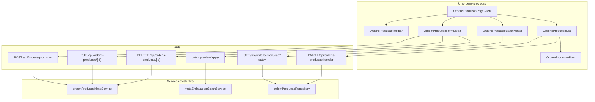

# Design: Tela Ordens de Produção (`/ordens-producao`)

**Data:** 2026-06-17  
**Status:** Aprovado pelo stakeholder  
**Depende de:** `2026-06-09-ordens-producao-design.mdx` (schema/domínio), `2026-06-12-meta-embalagem-sem-assadeira-design.mdx` (entrada em unidades)

## Contexto

Hoje o planejamento de ordens de produção é feito em `/meta/embalagem`, com UI antiga (fundo preto, cards agrupados por cliente, modais genéricos). A tabela `ordens_producao` já é a fonte de verdade; `PedidoEmbalagemRepository` é alias de `OrdemProducaoRepository`.

**Objetivo:** nova tela dedicada em `/ordens-producao` para listar, reordenar, criar, editar, excluir e importar ordens do dia — com UI/UX completamente nova, desktop-first, focada em planejamento (sem progresso de produção nem geração de etiqueta).

`/meta/embalagem` permanece como backup até remoção futura.

## Decisões de produto (validadas)

| Tema | Decisão |
|------|---------|
| Rota | `/ordens-producao` (sem prefixo `/meta`) |
| Navegação | Novo item no menu; `meta/embalagem` mantido como backup |
| Escopo da listagem | Somente planejamento — sem barra de progresso, sem etiqueta |
| Filtro de data | Por `data_producao`, padrão = hoje (timezone Brasil) |
| Reordenação | Drag-and-drop por `ordem_planejamento` no dia selecionado |
| Criar/editar | Campos iguais ao CSV de importação |
| Importação em lote | Reutilizar fluxo existente (preview → apply) |
| Dispositivo alvo | Desktop/notebook (planejamento no escritório) |
| Auto-refresh | Não — carrega ao mudar data ou após ações |
| Visual | **Warm Industrial** — stone + amber, inspirado em `/etiquetas` |

## Fora de escopo

- Progresso de produção (`produzido` / lotes de embalagem)
- Geração de etiquetas
- Remoção de `/meta/embalagem`
- Meta de produção forno (`/meta/producao`)
- Mobile-first / uso em chão de fábrica
- Polling automático (60s) da tela antiga

## Direção visual — Warm Industrial

| Token | Valor | Uso |
|-------|-------|-----|
| Fundo página | `stone-50` | Evita o preto absoluto da tela antiga |
| Superfície | `white` + borda `stone-200` | Painel da lista, modais |
| Texto primário | `stone-900` | Títulos, produto |
| Texto secundário | `stone-500` | Metadados, hints |
| Acento / CTA | `amber-600` hover `amber-700` | Botão primário, estados ativos |
| Destaque data etiqueta | badge `amber-100` / `amber-800` | Quando `data_etiqueta ≠ data_producao` |
| Ícones | Material Icons | Sem emoji como ícone estrutural |
| Tipografia | Geist (já no layout) | Números tabulares para prioridade e quantidades |
| Touch/focus | `min-h-11`, `focus-visible:ring-2 ring-amber-500` | Acessibilidade mínima mesmo em desktop |

Referência interna de qualidade: `/etiquetas` (toolbar clara, chips, botões `rounded-xl`).

## Layout da página

### Toolbar (sticky)

```
┌─────────────────────────────────────────────────────────────────────┐
│ Ordens de Produção          [Data ▼]  12 ordens • 48 LT • 1.920 UN │
│                              [Importar CSV]  [+ Nova ordem]         │
└─────────────────────────────────────────────────────────────────────┘
```

- **Data:** `<input type="date">` com label acessível
- **Resumo:** contagem de ordens + totais de latas e unidades do dia
- **Importar CSV:** abre modal de lote (reutilizado)
- **Nova ordem:** abre modal de formulário vazio

### Lista ordenável

Abordagem escolhida: **lista densa** (estilo Linear/Notion), uma linha por ordem, dentro de um único painel branco.

Colunas:

| Coluna | Conteúdo |
|--------|----------|
| Handle + # | `drag_indicator` + `ordem_planejamento` (atualiza ao arrastar) |
| Produto | Nome do produto (destaque) |
| Tipo estoque | Nome do tipo (ex.: Valepan, cliente) |
| Quantidade | Com assadeira: `N LT → X UN • Y CX`; sem: `N UN • Y CX` |
| Etiqueta | Data formatada `DD/MM`; badge se ≠ data filtrada |
| Observação | Truncada com `title` tooltip; vazio = em dash |
| Ações | Menu `⋮` → Editar, Excluir; setas ↑↓ como fallback teclado |

Interações:

- Clique na linha → abre edição
- Arrastar pelo handle → reorder optimistic + `PATCH /api/ordens-producao/reorder`
- Excluir → diálogo de confirmação

### Estados

| Estado | Comportamento |
|--------|---------------|
| Loading | Skeleton de 5 linhas |
| Vazio | Mensagem + CTAs "Nova ordem" e "Importar CSV" |
| Erro de carga | Banner com mensagem + botão "Tentar novamente" |
| Erro de reorder | Reverte ordem visual + toast de erro |
| Sucesso | Toast auto-dismiss 4s |

## Drag-and-drop

- Biblioteca: `@dnd-kit/core` + `@dnd-kit/sortable`
- Drag iniciado apenas pelo handle (evita conflito com clique na linha)
- Linha em drag: `shadow-lg`, opacidade ~0.9, `z-index` elevado
- Payload reorder: `{ dataProducao, orderedIds: string[] }` — API já existe
- Fallback acessível: botões Mover para cima / Mover para baixo no menu de ações

## Formulário criar/editar (`OrdemProducaoFormModal`)

Campos (iguais ao CSV):

1. **Data produção** — default = data do filtro
2. **Data etiqueta** — default = data produção
3. **Tipo estoque** — autocomplete (`/api/options/embalagem?type=clientes` ou endpoint dedicado)
4. **Produto** — autocomplete; ao selecionar, resolve modo de quantidade
5. **Quantidade:**
   - **Com assadeira:** Latas (LT) + seletor de assadeira + preview derivado
   - **Sem assadeira:** Unidades (UN) + preview `N UN • Y CX`
6. **Observação** — opcional, texto livre

Comportamento:

- Preview em tempo real usando mesma lógica de `ordem-derivados.ts`
- Criar → `ordemProducaoMetaService.createFromLatas` ou `createSemAssadeira`
- Editar → `ordemProducaoMetaService.updateFields` (campos completos)
- Excluir (só em edição) → `ordemProducaoMetaService.delete` com confirmação
- Bloqueio se já houver produção registrada (mensagem do service existente)
- Bloqueio se meta ficar abaixo do produzido (validação existente no service)

## Importação em lote

Reutilizar `MetaEmbalagemBatchModal` e APIs:

- `POST /api/embalagem/pedido/batch/preview`
- `POST /api/embalagem/pedido/batch/apply`

Opção de implementação: wrapper `OrdensProducaoBatchModal` que delega ao componente existente (evita duplicação). Após apply, recarregar lista da data filtrada.

Formato CSV (inalterado):

```
data produção;data etiqueta;tipo estoque;produto;latas/un;assadeira;observação
```

## Arquitetura



### Arquivos novos

| Arquivo | Responsabilidade |
|---------|------------------|
| `src/app/ordens-producao/page.tsx` | Rota, renderiza client |
| `src/components/OrdensProducao/OrdensProducaoPageClient.tsx` | Estado da página, orquestração |
| `src/components/OrdensProducao/OrdensProducaoToolbar.tsx` | Data, resumo, ações globais |
| `src/components/OrdensProducao/OrdensProducaoList.tsx` | DnD context + lista |
| `src/components/OrdensProducao/OrdemProducaoRow.tsx` | Linha individual |
| `src/components/OrdensProducao/OrdemProducaoFormModal.tsx` | Criar/editar/excluir |
| `src/components/OrdensProducao/OrdensProducaoBatchModal.tsx` | Wrapper do batch existente |
| `src/components/OrdensProducao/OrdensProducaoEmptyState.tsx` | Estado vazio |
| `src/components/OrdensProducao/OrdensProducaoListSkeleton.tsx` | Loading |
| `src/lib/managers/ordens-producao-list-manager.ts` | Fetch, reorder, CRUD client-side |
| `src/domain/types/ordens-producao-painel.ts` | DTO da listagem (nomes resolvidos) |
| `src/lib/services/ordens-producao-painel-service.ts` | Monta listagem com nomes de produto/tipo/assadeira |
| `src/app/api/ordens-producao/route.ts` | GET list + POST create |
| `src/app/api/ordens-producao/[id]/route.ts` | PUT update + DELETE |

### Arquivos modificados

| Arquivo | Mudança |
|---------|---------|
| `src/components/Navigation.tsx` | Link "Ordens de Produção" → `/ordens-producao` |
| `package.json` | `@dnd-kit/core`, `@dnd-kit/sortable`, `@dnd-kit/utilities` |

### Arquivos reutilizados (sem alteração obrigatória)

| Arquivo | Uso |
|---------|-----|
| `src/components/MetaEmbalagem/MetaEmbalagemBatchModal.tsx` | Importação CSV |
| `src/lib/services/ordem-producao-meta-service.ts` | CRUD |
| `src/lib/services/meta-embalagem-batch-service.ts` | Batch |
| `src/app/api/ordens-producao/reorder/route.ts` | Reorder |
| `src/data/producao/OrdemProducaoRepository.ts` | Persistência |

## API — contratos novos

### `GET /api/ordens-producao?date=YYYY-MM-DD`

Resposta:

```typescript
type OrdensProducaoListResponse = {
  date: string;
  resumo: {
    totalOrdens: number;
    totalLatas: number;
    totalUnidades: number;
  };
  ordens: Array<{
    id: string;
    ordemPlanejamento: number;
    dataProducao: string;
    dataEtiqueta: string;
    tipoEstoque: string;
    produto: string;
    observacao: string;
    modoQuantidade: 'latas' | 'unidades';
    assadeiras: number;
    assadeiraNome?: string;
    unidades: number;
    caixas: number;
    quantidadeLabel: string; // ex.: "12 LT → 480 UN • 20 CX"
  }>;
};
```

Ordenação: `ordem_planejamento ASC`.

### `POST /api/ordens-producao`

Body (criar):

```typescript
type OrdemProducaoCreateBody = {
  dataProducao: string;
  dataEtiqueta: string;
  tipoEstoque: string;
  produto: string;
  observacao?: string;
  modoQuantidade: 'latas' | 'unidades';
  latas?: number;
  unidades?: number;
  assadeiraNome?: string;
};
```

### `PUT /api/ordens-producao/[id]`

Mesmo body do POST (edição completa dos campos editáveis).

### `DELETE /api/ordens-producao/[id]`

- 204 em sucesso
- 400 se houver produção registrada (mensagem do service)

## Critérios de aceite

### Listagem

- [ ] `/ordens-producao` acessível pelo menu
- [ ] Filtro de data carrega ordens do dia por `data_producao`
- [ ] Lista ordenada por `ordem_planejamento`
- [ ] Resumo na toolbar (contagem + totais)
- [ ] Estados loading, vazio e erro funcionais
- [ ] Sem progresso de produção nem ação de etiqueta

### Reordenação

- [ ] Drag pelo handle reordena visualmente e persiste via API
- [ ] Falha de API reverte ordem visual
- [ ] Botões ↑↓ funcionam como alternativa

### CRUD

- [ ] Nova ordem com campos do CSV (latas ou unidades conforme produto)
- [ ] Edição abre modal pré-preenchido
- [ ] Exclusão com confirmação; bloqueada se houver produção
- [ ] Preview de quantidades derivadas no formulário
- [ ] Validações do `ordemProducaoMetaService` refletidas na UI

### Importação

- [ ] Importar CSV abre modal com preview/apply existente
- [ ] Após apply, lista recarrega

### Visual

- [ ] Fundo claro stone, painel branco, acento amber
- [ ] Sem emoji como ícones estruturais
- [ ] Contraste legível (WCAG AA em texto principal)
- [ ] Arquivos ≤ 500 linhas (split se necessário)

## Relação com specs anteriores

- **2026-06-09:** define schema, `ordem_planejamento`, reorder API — backend já implementado
- **2026-06-12:** produtos sem assadeira em unidades — formulário novo deve respeitar
- Esta spec cobre **somente a nova tela UI** em `/ordens-producao`
