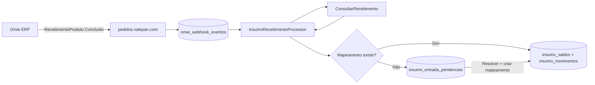

# Design: Estoque e custo de insumos via Omie (Fase 1)

**Data:** 2026-06-19  
**Status:** Aprovado pelo stakeholder  
**Fase 2 (fora de escopo):** Saída de estoque por produção/receita

## Contexto

O cadastro de insumos (`insumos`) existe em `/config/insumos` com `custo_unitario` manual. Não há controle de saldo nem integração com entradas do ERP.

No Omie, toda confirmação de recebimento de NF dispara o webhook `RecebimentoProduto.Concluido`. Hoje o evento vai para um endpoint Pipedream de teste (`https://eoey7ol6t9lmprp.m.pipedream.net`). Os eventos são gravados em `omie_webhook_eventos` no Supabase.

Com o `nIdReceb` do webhook, a API `ConsultarRecebimento` retorna os itens (`itensCabec`) com quantidade (`nQtdeNfe`), unidade (`cUnidadeNfe`), preço (`nPrecoUnit`) e total (`vTotalItem`).

O estoque de **produtos acabados** já usa `estoque_saldos` + `estoque_movimentos` por `tipo_estoque_id` + `produto_id`. Insumos precisam de modelo separado.

Infraestrutura Omie existente no Supabase: `empresas` (credenciais), `omie_webhook_eventos`, `integracao_produtos` (só produtos acabados — **não reutilizar** para insumos).

## Objetivos (Fase 1)

1. Registrar **entrada automática** de estoque quando NF de insumo é recebida no Omie.
2. Vincular produto Omie → insumo com **conversão de unidade**.
3. Atualizar **custo unitário** do insumo com o custo da **última NF** (simplicidade; evoluir depois).
4. Fila de **pendências** para itens sem mapeamento (modelo híbrido).
5. Tela `/estoque-insumos` para consultar saldos, histórico, ajustes manuais e resolver pendências.

## Decisões de produto (validadas)

| Tema | Decisão |
|------|---------|
| Saldo | Único por insumo — todas as empresas Omie somam no mesmo estoque |
| Mapeamento | Chave `(empresa_id, omie_id_produto)` → `insumo_id` + `fator_conversao` |
| Múltiplos fornecedores | Vários mapeamentos podem apontar para o mesmo insumo |
| Sem mapeamento | Fila de pendências; ao resolver, cria mapeamento permanente |
| Custo | Última NF: `custo = vTotalItem / qtd_convertida` na unidade do insumo |
| Produtos ignorados | Pendência marcada `ignorado` — não entra no estoque |
| Webhook teste | Pipedream (`eoey7ol6t9lmprp.m.pipedream.net`) |
| Webhook produção | `https://pedidos.valepan.com/api/webhooks/omie/recebimento` |
| Processamento | Neste app (valepan-interno); webhook gravado via pedidos |
| UI fase 1 | Consulta + ajuste manual + fila de pendências |

## Fora de escopo (Fase 1)

- Saída de estoque por produção/receita
- Custo médio ponderado
- CRUD dedicado de mapeamentos Omie (nascem ao resolver pendências)
- Separação de saldo por empresa
- Usuário/autor nos movimentos (campo reservado)
- Endpoint de webhook neste app (fica no pedidos, espelhando `/faturamento`)

## Arquitetura



### Abordagem escolhida

**Webhook no pedidos + processamento neste app** — consistente com webhook #01 de NF (`/api/webhooks/omie/faturamento`). Domínio de insumos permanece no app de produção.

### Componentes

| Componente | Responsabilidade |
|------------|------------------|
| `OmieRecebimentoClient` | Chama `ConsultarRecebimento` com credenciais da `empresa` |
| `InsumoRecebimentoProcessor` | Orquestra idempotência, itens, conversão, estoque |
| `InsumoEstoqueService` | Atualiza saldo, custo (última NF), grava movimento |
| `InsumoMapeamentoRepository` | CRUD de `(empresa_id, omie_id_produto)` → insumo + fator |
| `InsumoPendenciaRepository` | Fila de pendências e resolução |
| Cron / job | Processa eventos `status_processamento = pendente` |

### Fluxo por item da NF

1. Ignorar se `cIgnorarItem = "S"`.
2. Buscar mapeamento em `integracao_insumos` por `(empresa_id, nIdProduto)`.
3. `qtd_entrada = nQtdeNfe × fator_conversao` (unidade do insumo).
4. `custo_entrada = vTotalItem / qtd_entrada`.
5. Somar saldo; atualizar `insumos.custo_unitario = custo_entrada`.
6. Gravar movimento com referência `nIdReceb` + `nIdItem`.

Sem mapeamento: criar pendência com dados crus da NF.

## Schema

### Alteração em tabela existente

**`insumos`** — sem mudança estrutural. `custo_unitario` passa a ser atualizado automaticamente nas entradas por NF. Ajustes manuais de saldo **não** alteram o custo.

### Enum `insumo_movimento_origem`

```
entrada_nf | ajuste_manual | resolucao_pendencia
```

### Enum `insumo_pendencia_status`

```
pendente | resolvido | ignorado
```

### Tabela `integracao_insumos`

| Coluna | Tipo | Notas |
|--------|------|-------|
| `id` | uuid PK | |
| `empresa_id` | uuid FK → `empresas` | NOT NULL |
| `omie_id_produto` | bigint | `nIdProduto` |
| `omie_codigo_produto` | text | `cCodigoProduto` — referência |
| `insumo_id` | uuid FK → `insumos` | NOT NULL |
| `fator_conversao` | numeric(14,6) | `qtd_insumo = nQtdeNfe × fator` |
| `descricao_omie` | text | snapshot opcional |
| `ativo` | boolean | default `true` |
| `created_at` / `updated_at` | timestamptz | |

**Constraint:** `UNIQUE (empresa_id, omie_id_produto)`

**Exemplo:** caixa de 25 kg → `fator_conversao = 25`; 3 CX na NF → 75 kg no insumo.

### Tabela `insumo_saldos`

| Coluna | Tipo | Notas |
|--------|------|-------|
| `insumo_id` | uuid PK FK → `insumos` | saldo único global |
| `quantidade` | numeric(14,3) | default 0, >= 0 |
| `updated_at` | timestamptz | |

Criado automaticamente (0) ao cadastrar insumo ou no primeiro movimento.

### Tabela `insumo_movimentos`

| Coluna | Tipo | Notas |
|--------|------|-------|
| `id` | uuid PK | |
| `created_at` | timestamptz | |
| `insumo_id` | uuid FK | NOT NULL |
| `empresa_id` | uuid FK | nullable — rastreio em entradas NF |
| `delta_quantidade` | numeric(14,3) | positivo ou negativo |
| `saldo_resultante` | numeric(14,3) | saldo após o movimento |
| `custo_unitario` | numeric(14,6) | custo registrado no movimento |
| `origem` | `insumo_movimento_origem` | NOT NULL |
| `omie_n_id_receb` | bigint | nullable |
| `omie_n_id_item` | bigint | nullable |
| `omie_webhook_evento_id` | uuid FK | nullable |
| `pendencia_id` | uuid FK | nullable |
| `observacao` | text | nullable |

**Idempotência:** `UNIQUE (empresa_id, omie_n_id_receb, omie_n_id_item)` para `origem = entrada_nf`.

**Índices:** `(insumo_id, created_at DESC)`, `(origem)`, `(created_at DESC)`.

### Tabela `insumo_entrada_pendencias`

| Coluna | Tipo | Notas |
|--------|------|-------|
| `id` | uuid PK | |
| `empresa_id` | uuid FK | NOT NULL |
| `omie_webhook_evento_id` | uuid FK | nullable |
| `omie_n_id_receb` | bigint | NOT NULL |
| `omie_n_id_item` | bigint | NOT NULL |
| `omie_id_produto` | bigint | NOT NULL |
| `omie_codigo_produto` | text | |
| `descricao_produto` | text | |
| `quantidade_nf` | numeric(14,3) | `nQtdeNfe` |
| `unidade_nf` | text | `cUnidadeNfe` |
| `preco_unit_nf` | numeric(14,6) | `nPrecoUnit` |
| `valor_total_item` | numeric(14,2) | `vTotalItem` |
| `numero_nf` | text | |
| `data_emissao_nf` | date | nullable |
| `status` | `insumo_pendencia_status` | default `pendente` |
| `integracao_insumo_id` | uuid FK | preenchido ao resolver |
| `resolvido_em` | timestamptz | nullable |
| `created_at` | timestamptz | |

**Constraint:** `UNIQUE (empresa_id, omie_n_id_receb, omie_n_id_item)`

### RLS

Todas as tabelas novas com RLS habilitado:

- **SELECT:** `USING (true)` para autenticados
- **INSERT / UPDATE:** `WITH CHECK (true)` para autenticados
- **DELETE:** `USING ((SELECT is_admin()))`

Usar `(SELECT auth.uid())` e `(SELECT is_admin())` nas policies conforme padrão do projeto.

## Processamento

### Gatilho

Cron Vercel (a cada 2–5 min) chamando `POST /api/cron/processar-recebimentos-omie` com secret de cron.

### Fluxo do processor

1. Buscar `omie_webhook_eventos` com `topic` = `RecebimentoProduto.Concluido` (case-insensitive) e `status_processamento` pendente, ordenado por `received_at ASC`.
2. Por evento: resolver `empresa_id` pelo `app_key`; extrair `nIdReceb`; chamar `ConsultarRecebimento`.
3. Processar itens de `itensCabec` conforme regras de negócio.
4. Marcar evento `processado` ou `erro`.
5. Limite: 20 eventos por execução.

### Regras de negócio

| Situação | Ação |
|----------|------|
| Mapeamento existe | Entrada automática |
| Sem mapeamento + pendência nova | Criar pendência |
| Sem mapeamento + pendência existente | Skip |
| Item já movimentado | Skip silencioso |
| `cIgnorarItem = "S"` | Ignorar |
| Empresa não encontrada | Evento → `erro` |
| API Omie falha | Evento permanece pendente; retry |

### Tratamento de erros

| Camada | Estratégia |
|--------|------------|
| Omie timeout/5xx | Retry; após N tentativas → `erro` permanente |
| Resposta inválida | `erro` + log |
| `qtd_entrada = 0` | Erro no item, sem movimento |
| Ajuste manual → saldo negativo | Bloquear (default) |
| Webhook duplicado (`message_id`) | Skip se já processado |

## UI — `/estoque-insumos`

### Navegação

Entrada no hub Operação (`hub-nav-config.ts`), ícone `grain`, ao lado do estoque de produtos acabados.

### Layout

Duas abas: **Saldos** | **Pendências (N)**

Toolbar sticky: busca, filtro ativos/todos, resumo (`12 insumos • 847,5 kg • 3 pendências`).

### Aba Saldos

Tabela desktop + lista mobile. Colunas: Insumo, Unidade, Saldo (mono), Custo unitário (mono), Última entrada.

Ações: histórico (`history`), ajustar saldo (`tune`).

**Modal histórico:** movimentos com origem, delta, saldo resultante, custo, ref NF.

**Modal ajuste:** saldo atual readonly; novo saldo ou delta; observação obrigatória em ajustes não triviais; não altera custo.

### Aba Pendências

Colunas: NF, produto Omie, qtd NF, valor, empresa.

Ações: **Vincular** (modal com insumo + fator + preview de conversão/custo), **Ignorar**.

Ao vincular: cria `integracao_insumos`, processa entrada, marca `resolvido`.

### Config — vínculos Omie (somente leitura)

No `InsumoModal` em `/config/insumos`, seção colapsável listando mapeamentos do insumo.

## Estrutura de código

```
src/
  lib/clients/omie-recebimento-client.ts
  lib/services/insumo-estoque-service.ts
  lib/services/insumo-recebimento-processor.ts
  data/insumos/InsumoEstoqueRepository.ts
  data/insumos/InsumoMapeamentoRepository.ts
  data/insumos/InsumoPendenciaRepository.ts
  app/api/cron/processar-recebimentos-omie/route.ts
  app/estoque-insumos/
  features/insumo-estoque/
```

## Testes

| Tipo | Escopo |
|------|--------|
| Unitário | Conversão, custo, idempotência |
| Integração | Processor com mock Omie |
| Manual | 6 cenários listados abaixo |

**Cenários manuais:**

1. NF com mapeamento → entrada automática
2. NF sem mapeamento → pendência
3. Resolver pendência → saldo + mapeamento permanente
4. Reenvio webhook → sem duplicata
5. Ignorar pendência → não reaparece
6. Ajuste manual → movimento `ajuste_manual`, custo inalterado

## Rollout

1. Migration SQL (tabelas + enum + RLS)
2. Deploy processor (Pipedream continua em teste)
3. Deploy UI `/estoque-insumos`
4. Criar endpoint `/api/webhooks/omie/recebimento` no **pedidos** (tarefa paralela)
5. Trocar webhook Omie #02 para `https://pedidos.valepan.com/api/webhooks/omie/recebimento`
6. Ativar cron de processamento
7. Opcional: reprocessar eventos históricos em `omie_webhook_eventos`

### Endpoint de produção (referência)

| Ambiente | URL |
|----------|-----|
| Teste (atual) | `https://eoey7ol6t9lmprp.m.pipedream.net` |
| Produção | `https://pedidos.valepan.com/api/webhooks/omie/recebimento` |

Tópico Omie: `recebimentoproduto.concluido`
