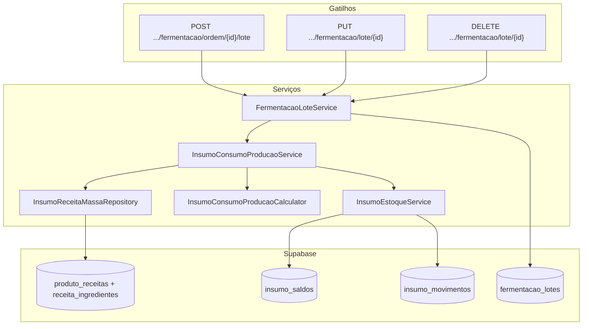

# Design: Saída de estoque de insumos por produção — Fermentação (Fase 2a)

**Data:** 2026-06-30  
**Status:** Aprovado pelo stakeholder  
**Depende de:** `2026-06-19-estoque-insumos-omie-design.mdx`, `2026-06-18-config-produtos-receitas-design.mdx`, `2026-06-17-fermentacao-forno-desligar-planilha-design.mdx`  
**Fases futuras:** 2b forno (brilho, confeito), 2c embalagem (antimofo, pacote, caixa)

## Contexto

A Fase 1 de insumos (`insumo_saldos` + `insumo_movimentos`) cobre entradas via Omie, ajuste manual e resolução de pendências. A saída por produção estava explicitamente fora de escopo.

O app já possui:

- Receitas com `receita_ingredientes` (insumo + `quantidade_padrao`) vinculadas a produtos via `produto_receitas` por tipo (`massa`, `brilho`, `confeito`, `antimofo`, `embalagem`, `caixa`)
- Lotes de fermentação em `fermentacao_lotes` (assadeiras ou unidades por lote)
- Padrão de vínculo lote → movimento em produto acabado (`estoque_movimentos.embalagem_lote_id` + delta na edição)

Fermentação **não** altera estoque de insumos hoje.

## Objetivos (Fase 2a)

1. Baixar estoque de insumos **proporcionalmente** ao lançar um lote de fermentação, usando a receita de **massa** do produto.
2. Ajustar movimentos ao **editar** ou **excluir** o lote (ledger append-only com correções).
3. Permitir **saldo negativo** (NF Omie pode entrar com atraso).
4. **Não bloquear** o fluxo de fermentação quando receita/cálculo estiver indisponível — aviso não bloqueante.
5. Exibir consumo no histórico de `/estoque-insumos` com motivo legível (produto, LT/UN, lote).

## Decisões de produto (validadas)

| Tema | Decisão |
|------|---------|
| Etapa nesta fase | Apenas **fermentação** |
| Tipos de receita | Apenas **massa** |
| Modelo multi-etapa (futuro) | Fermentação → massa; forno → brilho + confeito; embalagem → antimofo + embalagem + caixa |
| Cálculo de receitas | **Proporcional exato** — sem arredondar para 0,5 receita |
| Precisão numérica | `numeric(14,6)` em saldos e movimentos |
| Saldo negativo | **Permitido** |
| Sem receita / cálculo impossível | Lote salva normalmente; **sem movimentos**; aviso na API + toast amarelo |
| Saldo insuficiente | Baixa integral; saldo pode ficar negativo |
| Ajuste manual | Mantém fluxo atual em `/estoque-insumos` (também permite negativo após migration) |
| Backfill histórico | **Não** — lotes anteriores ao deploy ficam sem movimento |
| Transação | Lote e consumo em passos separados; falha no consumo **não** reverte o lote |

## Fora de escopo (Fase 2a)

- Consumo em forno e embalagem
- Fila de pendências de consumo não registrado
- Bloqueio de lançamento por saldo ou receita ausente
- Custo médio / custo da saída (movimento usa `custo_unitario` atual do insumo, como entradas)
- Backfill de lotes históricos

---

## Arquitetura



### Abordagem escolhida

**FK nullable no movimento + ledger append-only** — espelha `embalagem_lote_id` em `estoque_movimentos`, adaptado para N insumos por lote.

Alternativas descartadas:

| Abordagem | Motivo da rejeição |
|-----------|-------------------|
| Tabela intermediária `insumo_consumo_lote` | Mais complexidade sem ganho claro na v1 |
| Um movimento com JSON de itens | Quebra consultas por insumo e o modelo ledger atual |
| Baixar tudo na fermentação | Não reflete consumo real por etapa |

---

## Cálculo proporcional

```
modo = ordem.assadeiraId ? 'assadeiras' : 'unidades'

unidadesProduzidas =
  modo === 'assadeiras'
    ? lote.assadeiras × produto.unidades_assadeira
    : lote.unidades

receitasConsumidas = unidadesProduzidas ÷ produto_receitas.quantidade_por_produto   // tipo massa, ativo

para cada ingrediente em receita_massa.receita_ingredientes:
  consumoInsumo = receitasConsumidas × ingrediente.quantidade_padrao
```

**Exemplo:** 1 LT × 30 UN/LT = 30 UN; receita rende 100 UN → 0,3 receita; farinha 10 kg/receita → 3,000000 kg.

Retorna `null` + motivo se:

- Produto sem `produto_receitas` ativo tipo `massa`
- `quantidade_por_produto` ≤ 0
- Receita sem ingredientes com `insumo_id`
- Modo assadeiras sem `unidades_assadeira` no produto
- Quantidade produzida ≤ 0

---

## Schema

### Migration `YYYYMMDDHHMMSS_insumo_producao_saida.sql`

| Mudança | Detalhe |
|---------|---------|
| Precisão | `insumo_saldos.quantidade`, `insumo_movimentos.delta_quantidade`, `insumo_movimentos.saldo_resultante` → `numeric(14,6)` |
| Saldo negativo | `DROP` CHECK `quantidade >= 0` em `insumo_saldos` |
| Saldo negativo | `DROP` CHECK `saldo_resultante >= 0` em `insumo_movimentos` |
| FK | `fermentacao_lote_id uuid NULL REFERENCES fermentacao_lotes(id) ON DELETE SET NULL` em `insumo_movimentos` |
| Índice | `idx_insumo_mov_fermentacao_lote` em `(fermentacao_lote_id)` WHERE NOT NULL |
| Enum | Adicionar `producao_fermentacao` em `insumo_movimento_origem` |

**Reservado para fases 2b/2c (não nesta migration):** `forno_lote_id`, reutilizar `embalagem_lote_id` em `insumo_movimentos` para consumíveis de embalagem.

Sem índice único `(fermentacao_lote_id, insumo_id)` — ledger append-only aceita múltiplas linhas de correção.

### RLS

`insumo_movimentos` já tem RLS via service role nos repositórios. Nova coluna não exige política adicional (mesmo padrão das demais colunas).

---

## Fluxos de movimento

### Criar lote

1. `FermentacaoLoteService.criarLotePorOrdem` insere em `fermentacao_lotes` (inalterado).
2. `InsumoConsumoProducaoService.sincronizarFermentacaoLote(lote, ordem)`:
   - Carrega produto + receita massa via `InsumoReceitaMassaRepository`
   - `Calculator` → lista de consumos
   - Se lista vazia/null → `{ aplicado: false, avisos: [...] }`
   - Para cada insumo: `InsumoEstoqueService.aplicarDelta({ delta: -consumo, origem: 'producao_fermentacao', fermentacaoLoteId, observacao })`

### Editar lote

1. Atualiza lote (inalterado).
2. `ajustarFermentacaoLote(loteAntes, loteDepois, ordem)`:
   - Agrega consumo já registrado por insumo: `sum(delta_quantidade)` dos movimentos com `fermentacao_lote_id` (valores negativos)
   - Calcula consumo novo proporcional
   - `deltaCorrecao = -consumoNovo - consumoJaRegistrado` (onde consumoJaRegistrado é o negativo do sum)
   - Insere movimento de correção se `deltaCorrecao ≠ 0`

### Excluir lote

1. `estornarFermentacaoLote(lote, ordem)`:
   - Por insumo: `consumoTotal = -sum(deltas negativos)` → `aplicarDelta(+consumoTotal)` com observação de estorno
   - `clearFermentacaoLoteId(loteId)` nos movimentos (SET NULL), como embalagem
2. `fermentacao_lotes` delete (inalterado).

### Observação automática

```
Produção fermentação • {nomeProduto} • {N} LT ({M} UN) • lote {id8}
```

Omitir segmento LT ou UN conforme o modo da ordem. `id8` = primeiros 8 chars do UUID.

---

## Componentes

### Novos

| Arquivo | Responsabilidade |
|---------|------------------|
| `src/domain/insumos/insumo-consumo-producao-calculator.ts` | Cálculo puro proporcional |
| `src/domain/insumos/insumo-consumo-producao-calculator.test.ts` | Testes do cálculo |
| `src/lib/services/insumo-consumo-producao-service.ts` | Orquestra create / edit / delete |
| `src/lib/services/insumo-consumo-producao-service.test.ts` | Testes de orquestração |
| `src/data/insumos/InsumoReceitaMassaRepository.ts` | Query produto → receita massa + ingredientes |

### Alterados

| Arquivo | Mudança |
|---------|---------|
| `FermentacaoLoteService` | Chama consumo após create / update / delete |
| `InsumoEstoqueService` | `aplicarDelta()`; remove guard `novoSaldo < 0` em `ajustarSaldo` |
| `InsumoEstoqueRepository` | `fermentacao_lote_id` no insert; `listByFermentacaoLoteId`; `sumDeltaByFermentacaoLoteInsumo`; `clearFermentacaoLoteId` |
| `src/domain/types/insumo-estoque.ts` | Origem `producao_fermentacao` |
| `src/domain/types/insumo-estoque-db.ts` | Campo FK no input/row |
| `src/types/database.ts` | Regenerar ou atualizar manualmente |
| Rotas `api/producao/fermentacao/**` | Incluir `insumoConsumo: { aplicado, avisos }` na resposta |
| `formatters.ts` | Label e até 6 casas decimais |
| `InsumoSaldoTable` / `InsumoSaldoMobileList` | Saldo negativo em vermelho |
| `realizado/fermentacao/page.tsx` | Toast amarelo para avisos |

### Tipo de retorno da API

```ts
type InsumoConsumoResultado = {
  aplicado: boolean;
  avisos: string[];
};
```

Exemplo de resposta:

```json
{
  "message": "Lote criado com sucesso",
  "loteId": "uuid",
  "insumoConsumo": {
    "aplicado": false,
    "avisos": ["Estoque não atualizado: produto sem receita de massa vinculada"]
  }
}
```

---

## Tratamento de erros

| Situação | Comportamento |
|----------|---------------|
| Sem receita / cálculo impossível | Lote OK; `aplicado: false`; aviso descritivo |
| Erro de DB ao gravar movimento | Lote OK; `aplicado: false`; aviso + log servidor |
| Saldo ficaria negativo | Movimento gravado normalmente |
| Editar lote sem movimentos prévios | Trata consumo anterior como 0; insere saída integral |

Consumo roda em `try/catch` dentro do service — nunca propaga erro que impeça o lote.

---

## UI

### `/estoque-insumos`

- Histórico: badge **Produção fermentação** (`origemMovimentoTone`: `neutral` ou `accent`)
- `observacao` visível abaixo do delta
- Saldos negativos: `text-rose-700` na coluna quantidade
- `formatInsumoQuantidade`: `maximumFractionDigits: 6` (mínimo 0)

### `/realizado/fermentacao`

- Após salvar lote, se `insumoConsumo.avisos.length > 0` → toast amarelo (`tone="warning"`)
- Não bloqueia fechamento do modal

---

## Testes

### Unitários

- Calculator: 30 UN / 100 UN/receita; 2 LT × 30 UN; modo unidades; casos de falha
- Service: create N movimentos; edit com correção; delete com estorno; sem receita
- `InsumoEstoqueService.aplicarDelta`: saldo 5 − 8 = −3

### Manuais

1. Produto com receita → 1 LT → saldos proporcionais
2. Editar 1→2 LT → delta adicional
3. Excluir → estorno
4. Sem receita → lote + toast, saldo inalterado
5. Saldo baixo → negativo visível
6. Histórico com observação

---

## Rollout

1. Aplicar migration no Supabase
2. Domain + testes
3. Repository + `InsumoEstoqueService.aplicarDelta`
4. `InsumoConsumoProducaoService` + hook em `FermentacaoLoteService`
5. API responses + UI
6. Deploy

---

## Fases futuras

| Fase | Gatilho | FK | Tipos receita |
|------|---------|-----|---------------|
| 2b | `FornoLoteService` | `forno_lote_id` | `brilho`, `confeito` |
| 2c | `EmbalagemLoteService` | `embalagem_lote_id` | `antimofo`, `embalagem`, `caixa` |

`InsumoConsumoProducaoService` generaliza para `sincronizarPorEtapa({ etapa, loteId, ... })` reutilizando o mesmo calculator com tipos de receita configuráveis.
